# Automated 2D Peak Fitting Code

FitNMR enables fully automated peak fitting of 2D NMR spectra. This
document demonstrates how fitting can be done using `R` code, various
stages of the algorithm, and some of the ways that the results can be
visualized. For a description of how a similar workflow can be
accomplished using prewritten `R` scripts that process all the spectra
you put in a given directory, see the “Automated 2D Peak Fitting
Scripts” document.

The following tutorial will assume you have loaded the FitNMR package.

``` r
library(fitnmr)
```

## Sample Data

The first step in peak picking is to load one or more spectra. There are
a number of example spectra that come with the FitNMR package. For this
tutorial, we will be using spectra from a T₁ measurement of a small *de
novo* designed mini-protein. The directory containing that data and the
spectrum filenames can be determined with the following commands:

``` r
t1_dir <- system.file("extdata", "t1", package="fitnmr")
t1_ft2_filenames <- list.files(t1_dir, pattern=".ft2")
t1_ft2_filenames
#> [1] "1.ft2" "2.ft2"
```

## Reading Spectra

The `read_nmrpipe` function is used to read NMRPipe-formatted spectra.

To read both files, we will use the `lapply` function in R. This builds
a list data structure by iterating over the items in the first argument
and applying the function given in the second argument to each. Any
subsequent arguments are passed to the function when it is called. The
`file.path` function joins the directory where the files are located to
the file names within that directory.

The `dim_order="hx"` argument tells `read_nmrpipe` to reorder the
dimensions of the spectra so that the ¹H dimension is first. This is
important as most default NMRPipe processing scripts will leave the ¹H
as the second dimension. After reading the list of spectra, we will
assign names to each using the original filenames.

``` r
spec_list <- lapply(file.path(t1_dir, t1_ft2_filenames), read_nmrpipe, dim_order="hx")
names(spec_list) <- t1_ft2_filenames
```

The underlying data structures used to store the two spectra can be
shown with the `str` function:

``` r
str(spec_list)
#> List of 2
#>  $ 1.ft2:List of 4
#>   ..$ int    : num [1:66, 1:45] 1243 1033 2060 2653 2102 ...
#>   .. ..- attr(*, "dimnames")=List of 2
#>   .. .. ..$ HN : chr [1:66] "8.6770160099608" "8.66967763204871" "8.66233925413663" "8.65500087622454" ...
#>   .. .. ..$ N15: chr [1:45] "124.032918497401" "123.917245763118" "123.801573028835" "123.685900294552" ...
#>   ..$ ppm    :List of 2
#>   .. ..$ HN : num [1:66] 8.68 8.67 8.66 8.66 8.65 ...
#>   .. ..$ N15: num [1:45] 124 124 124 124 124 ...
#>   ..$ fheader: num [1:34, 1:2] 66 24 387 6558 800 ...
#>   .. ..- attr(*, "dimnames")=List of 2
#>   .. .. ..$ : chr [1:34] "SIZE" "APOD" "SW" "ORIG" ...
#>   .. .. ..$ : chr [1:2] "HN" "N15"
#>   ..$ header : Named num [1:512] 0.00 4.01e+09 2.35 0.00 0.00 ...
#>   .. ..- attr(*, "names")= chr [1:512] "FDMAGIC" "FDFLTFORMAT" "FDFLTORDER" "" ...
#>  $ 2.ft2:List of 4
#>   ..$ int    : num [1:66, 1:45] -679 -355 260 642 413 ...
#>   .. ..- attr(*, "dimnames")=List of 2
#>   .. .. ..$ HN : chr [1:66] "8.6770160099608" "8.66967763204871" "8.66233925413663" "8.65500087622454" ...
#>   .. .. ..$ N15: chr [1:45] "124.032918497401" "123.917245763118" "123.801573028835" "123.685900294552" ...
#>   ..$ ppm    :List of 2
#>   .. ..$ HN : num [1:66] 8.68 8.67 8.66 8.66 8.65 ...
#>   .. ..$ N15: num [1:45] 124 124 124 124 124 ...
#>   ..$ fheader: num [1:34, 1:2] 66 24 387 6558 800 ...
#>   .. ..- attr(*, "dimnames")=List of 2
#>   .. .. ..$ : chr [1:34] "SIZE" "APOD" "SW" "ORIG" ...
#>   .. .. ..$ : chr [1:2] "HN" "N15"
#>   ..$ header : Named num [1:512] 0.00 4.01e+09 2.35 0.00 0.00 ...
#>   .. ..- attr(*, "names")= chr [1:512] "FDMAGIC" "FDFLTFORMAT" "FDFLTORDER" "" ...
```

This shows that there is a list of two spectra. Each spectrum is itself
a list with four named components:

1.  `int`: A multidimensional array with the intensities of the
    spectrum, which in this case is just a 2D matrix. The chemical
    shifts are stored in character format in the dimension names
    (`dimnames`) of the array.
2.  `ppm`: A list of chemical shifts for each dimension stored in
    numeric format.
3.  `fheader`: A matrix of header values associated each dimension.
4.  `header`: The raw data from the 512-value NMRPipe header.

## Displaying Spectra

We can produce a contour plot of the first spectrum using the
`contour_pipe` function. It takes a matrix as input, so we must extract
the `int` matrix of the first spectrum with the syntax shown.

``` r
contour_pipe(spec_list[[1]]$int)
```


As you can see above, the spectrum has a number of overlapped peaks with
possible shoulders.

## Estimating Noise

The automated peak fitting procedure uses the noise level of each
spectrum to determine a cutoff below which peaks will no longer be
added. FitNMR includes a function, `noise_estimate`, for determining the
noise level by fitting a Gaussian function to a histogram of the signal
intensities.

The `sapply` function below is similar to the `lapply` function used
above, but it attempts to simplify the output of each function into a
matrix. In this case, because a vector of three numerical values is
returned each time `noise_estimate` is called, a 3xN matrix (N = the
number of spectra) of results is created. Also, because the
`noise_estimate` function just takes numerical intensities, the code
below defines a short inline function to extract those from each
spectrum.

``` r
noise_mat <- sapply(spec_list, function(x) noise_estimate(x$int))
noise_mat
#>           1.ft2     2.ft2
#> mu       928.52    385.31
#> sigma   1097.91    739.07
#> max   404348.28 116520.75
```

The resulting matrix above gives the mean value the noise is centered on
(`mu`), the standard deviation of the noise (`sigma`), and the maximum
intensity in the spectrum (`max`).

The `noise_estimate` function can create plots showing the histogram of
the intensity values (black) and the fit Gaussian function (blue). S/N
is defined as `max/sigma`.

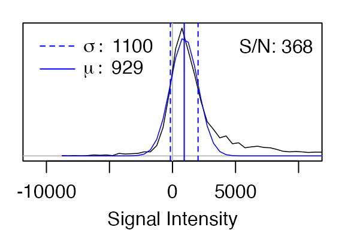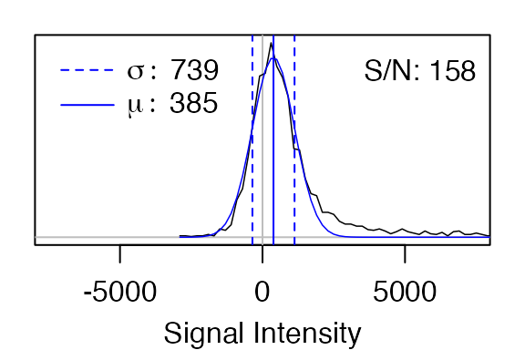

    #>           1.ft2     2.ft2
    #> mu       928.52    385.31
    #> sigma   1097.91    739.07
    #> max   404348.28 116520.75

To identify an initial set of peaks, better results will probably be
obtained using the spectrum with the highest signal-to-noise ratio,
which in this case is the first spectrum.

## Fitting Peaks

### Fitting a Few Peak Clusters

We will start by running three iterations of the iterative peak fitting
method. It takes a list of spectra, which we previously read into
``` spec_list``. In this case, we will only do the fitting on the first spectrum. To get a list of just one spectrum, use single square brackets, ```\[
\]`, which return another list. (By contrast double square brackets,`\[\[
\]\]`, return individual items from the list that are not enclosed in a list data structure.) The`iter_max`argument in`fit_peak_iter\`
specifies the number of iterations to perform.

FitNMR outputs text describing what the peak fitting algorithm is doing.
Adding the first peak involves addition of 6 parameters to the model (2
`omega0`, 2 `r2`, 1 `m0`, and 1 scalar coupling). The probability of the
observed improvement to the fit happening at random (according to an
F-test) is given by the p-value. For the first peak added, this is very
low, indicating that having a peak at that position is much better than
assuming otherwise. Adding the second peak involves addition of just 3
parameters (2 `omega0` and 1 `m0`), because several of the parameters
are shared with the first peak (2 `r2` and 1 scalar coupling). For the
first iteration, the search is terminated after the third peak fails to
fall below the p-value cutoff, which is specified by `f_alpha` and
defaults to `0.001`.

The `fit_peak_iter` function returns a list of fits, one for each
iteration. To convert that into a more user-friendly table, use the
`param_list_to_peak_df` function. The first couple columns of that table
give the peak number and fit iteration at which the peak was added. If
applicable, the F-test p-value will be given next. The following several
columns give the peak position (in ppm), the scalar coupling (in Hz),
and the R₂ (in Hz), with the integer suffix indicating the dimension for
each parameter. The remaining columns give the peak volumes from each
spectrum.

``` r
peak_fits <- fit_peak_iter(spec_list[1], iter_max=3)
#> Fit iteration 1:
#>   0 ->  6 fit parameters: F = 333.8 (p = 4.56642e-10)
#>   6 ->  9 fit parameters: F = 64.6 (p = 1.11899e-05)
#> Warning in minpack.lm::nls.lm(fit_par, fit_lower, fit_upper, fn = fit_fn, : lmder: info = -1. Number of iterations has reached `maxiter' == 200.
#>   9 -> 12 fit parameters: F = 1.2 (p = 0.464698)
#>  Terminating search because F-test p-value > 0.001
#> Fit iteration 2:
#>   0 ->  6 fit parameters: F = 734.0 (p = 1.87653e-15)
#>   6 ->  9 fit parameters: F = 14.7 (p = 0.000581712)
#>   9 -> 12 fit parameters: F = 0.1 (p = 0.976358)
#>  Terminating search because F-test p-value > 0.001
#> Fit iteration 3:
#>   0 ->  6 fit parameters: F = 27.7 (p = 7.52698e-13)
#>   6 ->  9 fit parameters: F = 226.0 (p = 2.5923e-27)
#>   9 -> 12 fit parameters: F = 13.3 (p = 1.34241e-05)
#>  12 -> 15 fit parameters: F = 68.7 (p = 1.46797e-13)
#>  15 -> 18 fit parameters: F = 7.0 (p = 0.00144316)
#>  Terminating search because F-test p-value > 0.001
peak_df <- param_list_to_peak_df(peak_fits)
peak_df
#>   peak fit   f_pvalue omega0_ppm_1 omega0_ppm_2 sc_hz_1 r2_hz_1 r2_hz_2      1.ft2
#> 1    1   1 4.5664e-10       8.2476       121.87  3.2806  2.9072  2.3345  824420657
#> 2    2   1 1.1190e-05       8.2596       121.93  3.2806  2.9072  2.3345  240560662
#> 3    3   2 1.8765e-15       8.5400       119.76  2.0000  4.7886  2.0996 1020008726
#> 4    4   2 5.8171e-04       8.5202       119.73  2.0000  4.7886  2.0996   89977216
#> 5    5   3 7.5270e-13       8.6124       123.36  7.6481  5.2849  2.1801  848579189
#> 6    6   3 2.5923e-27       8.5853       123.03  7.6481  5.2849  2.1801  607904936
#> 7    7   3 1.3424e-05       8.6449       123.47  7.6481  5.2849  2.1801  147984411
#> 8    8   3 1.4680e-13       8.5370       122.96  7.6481  5.2849  2.1801  161971930
plot_peak_df(peak_df, spec_list[1], cex=0.6)
```

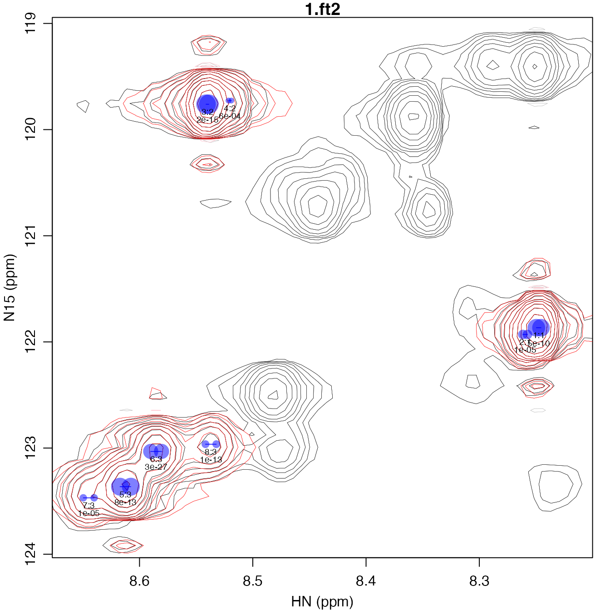

A plot of the resulting peak fits can be produced with the
`plot_peak_df` function, which requires a peak table and list of
spectra. It plots the peaks with contours down to 4 times the standard
deviation of the noise present in the spectra. The modeled peaks are
shown with red contours and the peak centers are indicated with blue
dots, with the area of the blue dot proportional to the volume of the
peak. Below each set of dots, the peaks are numbered with the syntax,
`<peak>:<fit>`. All peaks in a given fit will share scalar coupling and
R₂ parameters. If contained in the input table, the F-test p-value will
be given below the peak number. This can be helpful in optimizing the
the `f_alpha` parameter to avoid false negatives while minimizing the
number of false positives.

### A Peek Inside the Algorithm

To take a more detailed look inside a single iteration of the algorithm,
the `fit_peak_iter` function can be called again, providing the output
of the first time it was run using the `fit_list` parameter. By setting
the `plot_fit_stages` parameter to `TRUE`, FitNMR will produce a series
of plots illustrating the progress of the algorithm.

A given iteration starts with placing a peak at the highest point in the
spectrum, after all previously modeled peaks have been subtracted out.
It first optimizes `m0`, leaving the `omega0`, `r2`, and `sc` parameters
at their default values. The resulting peak is shown in the first plot,
with red dots at the peak centers and lines `±r2` for each dimension.

After obtaining an initial volume, the peak shape is allowed to change
by unfixing the `r2` and `sc` parameters. Subsequent plots show contours
of peaks modeled with the input parameters in blue, and the fit
parameters in red. Finally, the peak is allowed to move by unfixing the
`omega0` parameters, with the center of each multiplet constrained to
`±1.5*r2`, as indicated by the gray square.

``` r
peak_fits <- fit_peak_iter(spec_list[1], iter_max=1, fit_list=peak_fits, plot_fit_stages=TRUE)
#> Fit iteration 1:
```

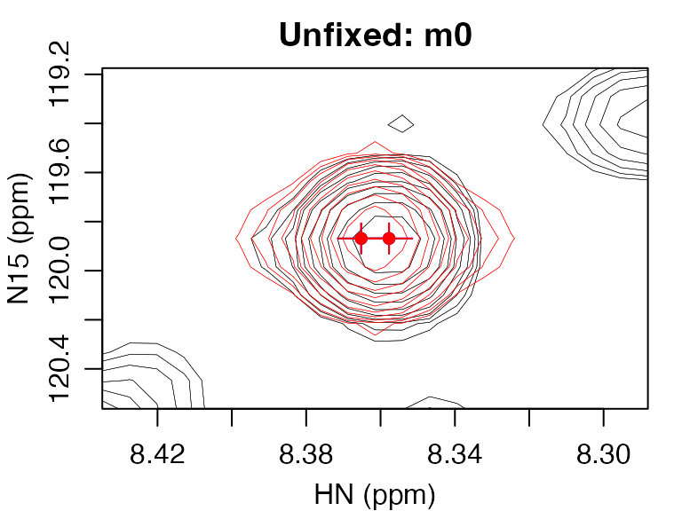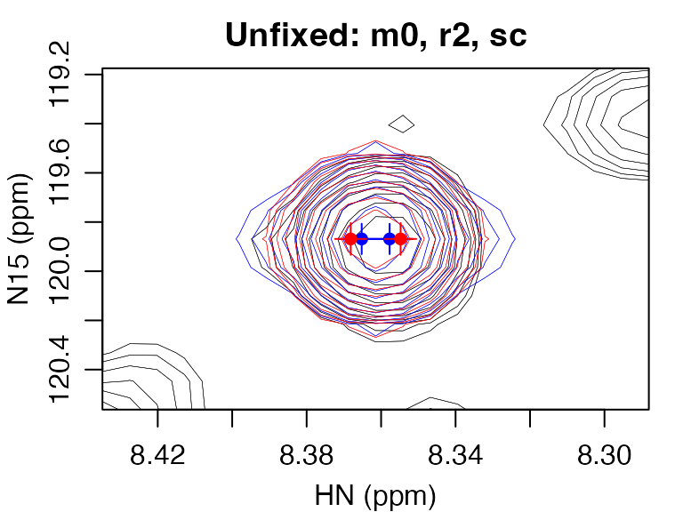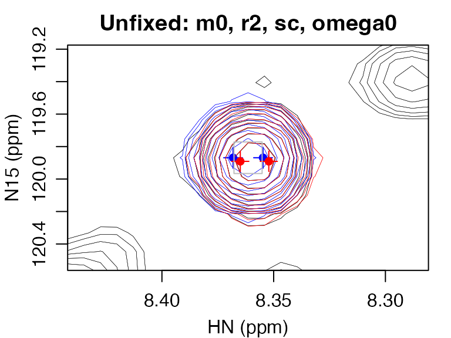

    #>   0 ->  6 fit parameters: F = 2022.7 (p = 1.60653e-20)

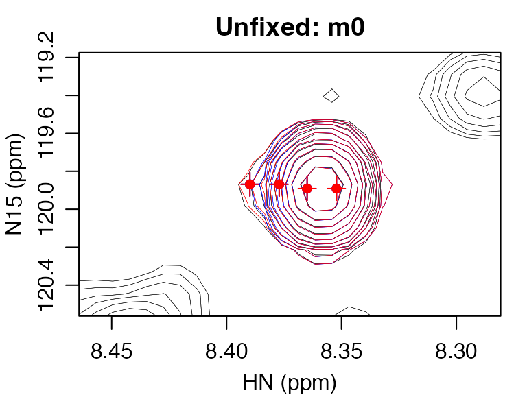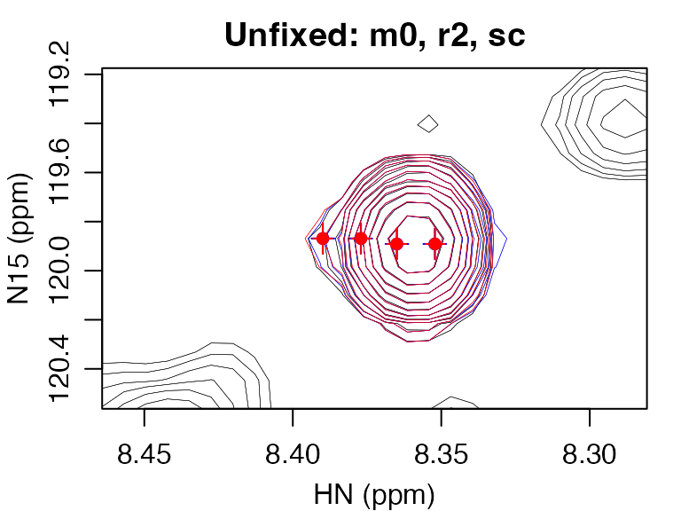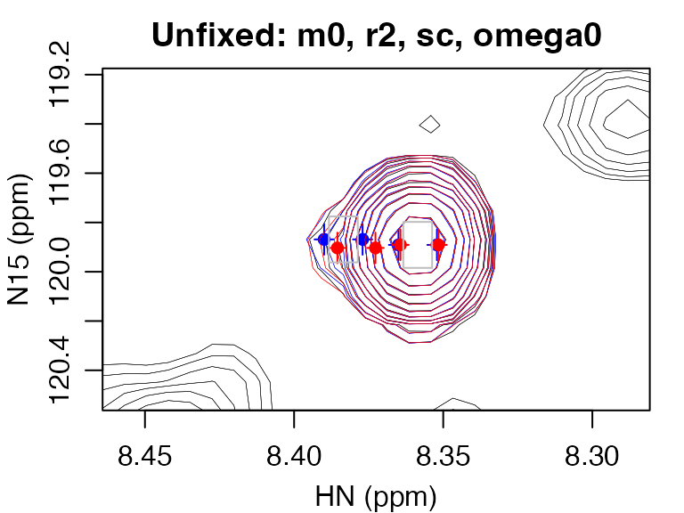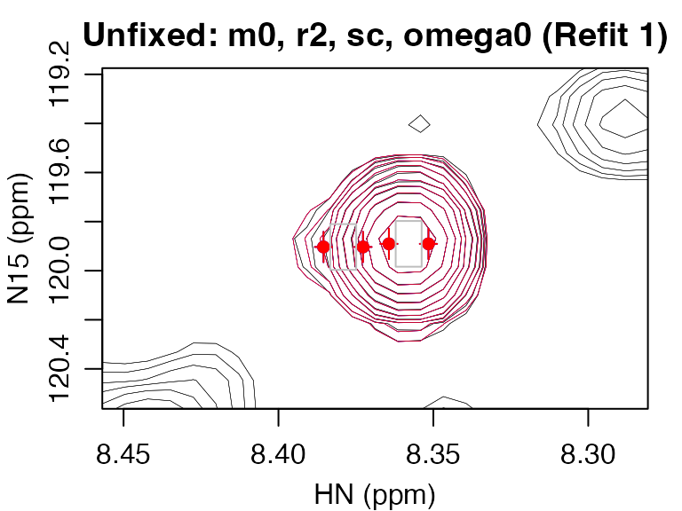

    #>   6 ->  9 fit parameters: F = 14.0 (p = 0.000228688)

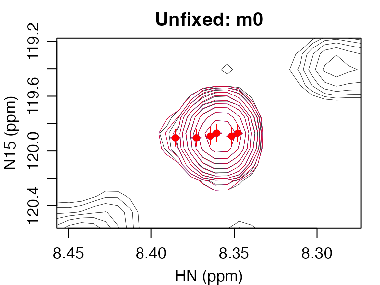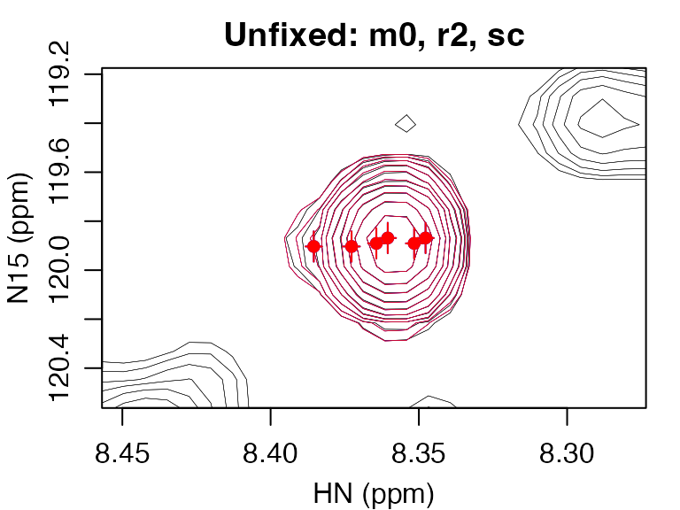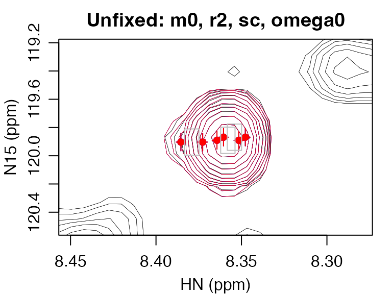

    #>  Terminating search because fit produced zero volume

In this case, the last peak added was too close to the first and when
all parameters were unfixed, one of the peaks had zero volume, which
resulted in termination of this iteration. In this fit, the shoulder
peak is present, but is less than 10% of the volume of the major peak.
(See fit 4 in the peak lists below.) The newly added peak cluster is
outlined in green in the following spectrum.

``` r
plot_peak_df(param_list_to_peak_df(peak_fits), spec_list[1], cex=0.6)
rect(8.41, 120.6, 8.31, 119.2, border="green")
text(8.31, 119.9, "New Cluster", pos=4, col="green")
```

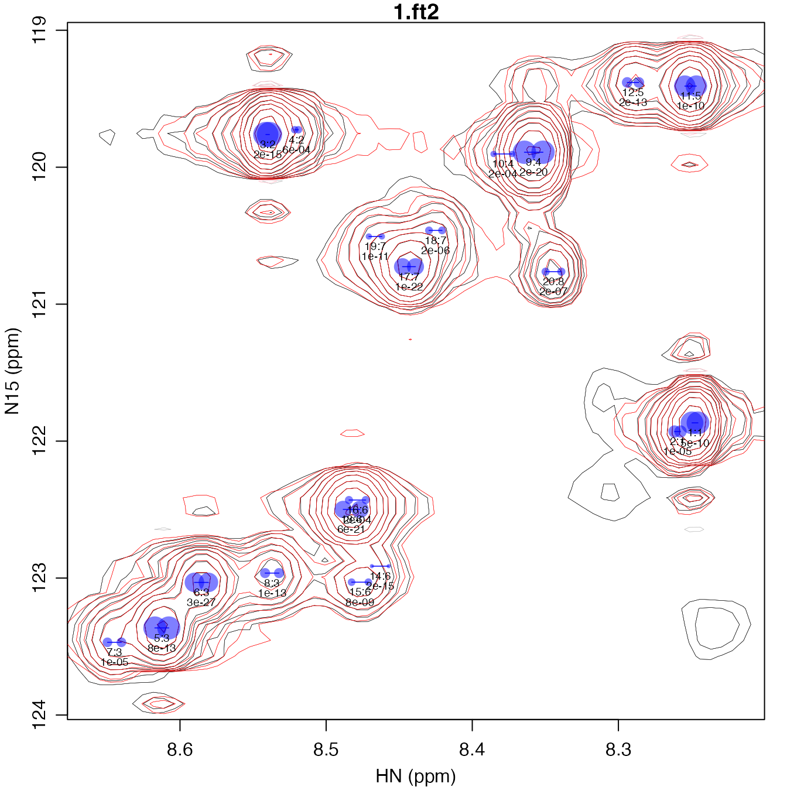

### Fitting the Remainder of the Peaks

To fit the remainder of the peaks, call the `fit_peak_iter` function
again, this time leaving out the `iter_max` parameter so that the
default value (100) is used.

``` r
peak_fits <- fit_peak_iter(spec_list[1], fit_list=peak_fits)
#> Fit iteration 1:
#>   0 ->  6 fit parameters: F = 107.8 (p = 9.74212e-11)
#>   6 ->  9 fit parameters: F = 260.6 (p = 2.04021e-13)
#>   9 -> 12 fit parameters: F = 11.0 (p = 0.00161564)
#>  Terminating search because F-test p-value > 0.001
#> Fit iteration 2:
#>   0 ->  6 fit parameters: F = 1219.7 (p = 6.27674e-21)
#>   6 ->  9 fit parameters: F = 174.9 (p = 1.74543e-15)
#>   9 -> 12 fit parameters: F = 42.3 (p = 8.00775e-09)
#>  12 -> 15 fit parameters: F = 11.8 (p = 0.000186865)
#>  15 -> 18 fit parameters: F = 1.6 (p = 0.223018)
#>  Terminating search because F-test p-value > 0.001
#> Fit iteration 3:
#>   0 ->  6 fit parameters: F = 232.0 (p = 1.0692e-22)
#>   6 ->  9 fit parameters: F = 15.9 (p = 1.99824e-06)
#>   9 -> 12 fit parameters: F = 54.3 (p = 1.15821e-11)
#>  Terminating search because fit produced zero volume
#> Fit iteration 4:
#>   0 ->  6 fit parameters: F = 330.9 (p = 1.75035e-07)
#>   6 ->  9 fit parameters: F = 1.8 (p = 0.274918)
#>  Terminating search because F-test p-value > 0.001
peak_df <- param_list_to_peak_df(peak_fits)
peak_df
#>    peak fit   f_pvalue omega0_ppm_1 omega0_ppm_2 sc_hz_1 r2_hz_1 r2_hz_2      1.ft2
#> 1     1   1 4.5664e-10       8.2476       121.87  3.2806  2.9072 2.33450  824420657
#> 2     2   1 1.1190e-05       8.2596       121.93  3.2806  2.9072 2.33450  240560662
#> 3     3   2 1.8765e-15       8.5400       119.76  2.0000  4.7886 2.09965 1020008726
#> 4     4   2 5.8171e-04       8.5202       119.73  2.0000  4.7886 2.09965   89977216
#> 5     5   3 7.5270e-13       8.6124       123.36  7.6481  5.2849 2.18012  848579189
#> 6     6   3 2.5923e-27       8.5853       123.03  7.6481  5.2849 2.18012  607904936
#> 7     7   3 1.3424e-05       8.6449       123.47  7.6481  5.2849 2.18012  147984411
#> 8     8   3 1.4680e-13       8.5370       122.96  7.6481  5.2849 2.18012  161971930
#> 9     9   4 1.6065e-20       8.3580       119.89 10.2029  2.2306 5.03575  875241831
#> 10   10   4 2.2869e-04       8.3791       119.90 10.2029  2.2306 5.03575   62766713
#> 11   11   5 9.7421e-11       8.2506       119.41  6.3683  4.9091 1.85341  732475431
#> 12   12   5 2.0402e-13       8.2900       119.38  6.3683  4.9091 1.85341  181301641
#> 13   13   6 6.2767e-21       8.4826       122.50  9.1982  5.0619 2.03464  475854299
#> 14   14   6 1.7454e-15       8.4629       122.91  9.1982  5.0619 2.03464   28166195
#> 15   15   6 8.0078e-09       8.4768       123.03  9.1982  5.0619 2.03464   92626742
#> 16   16   6 1.8687e-04       8.4786       122.43  9.1982  5.0619 2.03464  105607485
#> 17   17   7 1.0692e-22       8.4433       120.73  7.1444  6.3350 2.97224  460752250
#> 18   18   7 1.9982e-06       8.4251       120.46  7.1444  6.3350 2.97224   97674580
#> 19   19   7 1.1582e-11       8.4663       120.51  7.1444  6.3350 2.97224   62014526
#> 20   20   8 1.7504e-07       8.3444       120.76  8.6176  1.9530 0.86044  105614247
plot_peak_df(peak_df, spec_list[1], cex=0.6)
```


## Fitting Peaks without Scalar Couplings

Scalar couplings are only fit for specified dimensions. The only type of
splitting pattern currently supported is a doublet. The particular
dimensions for which scalar couplings are fit is specified with the
`sc_start` parameter, which should be a two-element numeric vector. The
first element of that vector gives the starting value of the scalar
coupling in the first dimension, and likewise the second element for the
second dimension. If a given dimension is set to `NA`, then it will not
have a doublet generated. If `sc_start` is left at the default value of
`c(6, NA)`, then there will just be a doublet fit in the first
dimension, with only a single peak fit in the second dimension. To
disable scalar couplings altogether, set `sc_start` to `c(NA, NA)`.

``` r
peak_fits_no_sc <- fit_peak_iter(spec_list[1], sc_start=c(NA, NA))
plot_peak_df(param_list_to_peak_df(peak_fits_no_sc), spec_list[1], cex=0.6)
rect(8.55, 122.8, 8.43, 122.1, border="green")
text(8.43, 122.5, "Coupling\nDetected\nde novo", pos=4, col="green")
```

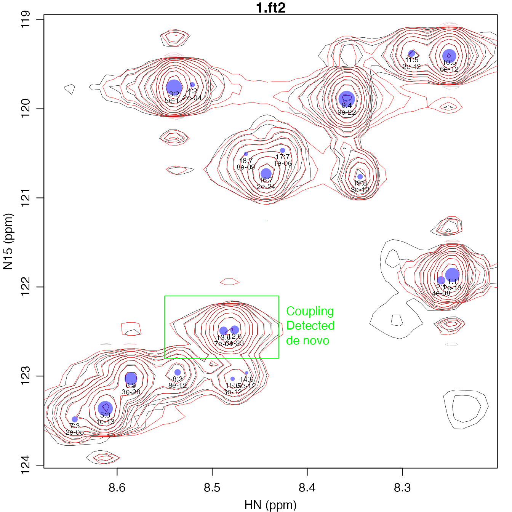

Many of the peaks in the above plot can be fit reasonably well without
scalar couplings, but the contours do not necessarily match up as well.
For one peak boxed in green above, a scalar coupling is detected *de
novo* by the fitting algorithm, with two adjacent peaks having roughly
the same volume.

## Editing Fit Clusters

### Separating Fit Clusters

After performing an initial fit, there may be large clusters of peaks
that can be separated into different clusters and refit to allow the
peak shapes to take on different values. For instance, peaks 5 and 7
shown in “Splitting the Reminder of Peaks” above are sufficiently
separated from peaks 6 and 8 in both the vertical and horizontal
dimensions, such that it should be possible to fit different peak shape
parameters. To separate them out into their own cluster, reassign them a
new “fit” cluster that is greater than any other fit group.

``` r
edited_peak_df <- peak_df
edited_peak_df[c(5,7),"fit"] <- max(edited_peak_df[,"fit"])+1
```

### Deleting Peaks

Furthermore, you may find that the algorithm has been overzealous and
detected peaks that do not appear to be real after visual inspection,
for instance peaks 4, 14, and 16. To remove them, simply remove their
rows from the peak table. In this case we use the the feature of R that
removes elements using a negative index:

``` r
edited_peak_df <- edited_peak_df[-c(4,14,16),]
```

Even if you don’t separate groups or delete peaks, it may be helpful to
perform a simultaneous fit of all peaks together to remove bias that may
have accumulated because of overlap between groups of peaks that were
originally fit separately. To do so, you need to convert the peak table
back a fit fit input. That is done with the `peak_df_to_fit_input`
function, which requires the peak table, the set of spectra, and the
size of the region of interest around each peak where fitting will be
done.

Also, you will need to manually update the lower and upper bounds for
parameters, which is done automatically with `fit_peak_iter`. Here we
use `update_fit_bounds` to constrain omega0 within 1.5 times `r2` of the
starting value, `r2` to be in the range of 0.5-20 Hz, and the scalar
coupling to be in the range of 2-12 Hz. Finally, we do the fit using the
`perform_fit` function.

``` r
refined_fit_input <- peak_df_to_fit_input(edited_peak_df, spec_list[1], omega0_plus=c(0.075, 0.75))
refined_fit_input <- update_fit_bounds(refined_fit_input, omega0_r2_factor=1.5, r2_bounds=c(0.5, 20), sc_bounds=c(2, 12))
refined_fit_output <- perform_fit(refined_fit_input)
refined_peak_df <- param_list_to_peak_df(refined_fit_output)
refined_peak_df
#>    peak fit omega0_ppm_1 omega0_ppm_2 sc_hz_1 r2_hz_1 r2_hz_2      1.ft2
#> 1     1   1       8.2476       121.87  3.3464  2.8966 2.31700  823653909
#> 2     2   1       8.2596       121.93  3.3464  2.8966 2.31700  239523089
#> 3     3   2       8.5395       119.76  2.0000  5.7031 2.07497 1120869405
#> 5     4   3       8.6123       123.37  9.4647  3.2949 2.36755  777520645
#> 6     5   4       8.5853       123.04  6.0584  6.5825 1.79531  632570914
#> 7     6   3       8.6439       123.45  9.4647  3.2949 2.36755  163968213
#> 8     7   4       8.5370       122.96  6.0584  6.5825 1.79531  151176016
#> 9     8   5       8.3575       119.89 10.1574  1.7355 4.73942  803199446
#> 10    9   5       8.3749       119.90 10.1574  1.7355 4.73942   96757331
#> 11   10   6       8.2506       119.41  6.0938  5.0267 1.77681  731298695
#> 12   11   6       8.2901       119.38  6.0938  5.0267 1.77681  180468792
#> 13   12   7       8.4819       122.49  9.4013  5.0804 2.41289  587356398
#> 15   13   7       8.4745       123.01  9.4013  5.0804 2.41289  108282766
#> 17   14   8       8.4433       120.73  9.1220  4.8622 3.19641  436460816
#> 18   15   8       8.4244       120.47  9.1220  4.8622 3.19641   95394763
#> 19   16   8       8.4672       120.52  9.1220  4.8622 3.19641   64410776
#> 20   17   9       8.3442       120.76  8.3984  1.5895 0.91163   97880231
plot_peak_df(refined_peak_df, spec_list[1], cex=0.6)
```

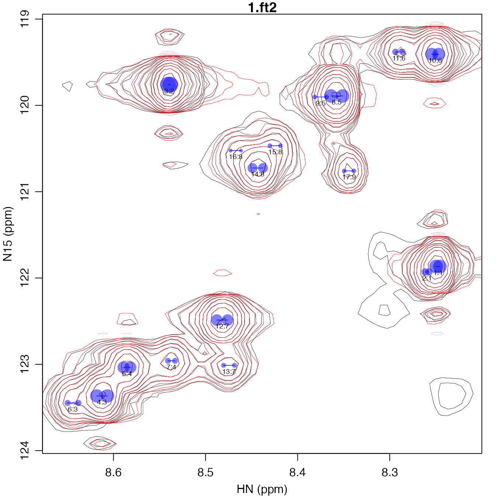

## Extending the Fit to Other Spectra

If you have a series of spectra with similar peak shapes, as in this
case, you can then extend the fit to more than one spectrum in a manner
similar to how we produced the refined peak table above, but instead
giving a list of multiple spectra to `peak_df_to_fit_input`.

``` r
extended_fit_input <- peak_df_to_fit_input(refined_peak_df, spec_list, omega0_plus=c(0.075, 0.75))
```

We can take a peek at the parameters that show the starting volumes for
the refined and extended fits as shown below. Note that the starting
volumes for the second spectrum is a second column in the `m0` matrix,
which has inherited the volumes from the first spectrum. After
performing the fit, the second spectrum has much lower volumes.

``` r
head(refined_fit_output$fit_list$m0)
#>           [,1]
#> [1,] 411826954
#> [2,] 411826954
#> [3,] 119761545
#> [4,] 119761545
#> [5,] 560434702
#> [6,] 560434702
head(extended_fit_input$start_list$m0)
#>           [,1]      [,2]
#> [1,] 411826954 411826954
#> [2,] 411826954 411826954
#> [3,] 119761545 119761545
#> [4,] 119761545 119761545
#> [5,] 560434702 560434702
#> [6,] 560434702 560434702
extended_fit_input <- update_fit_bounds(extended_fit_input, omega0_r2_factor=1.5, r2_bounds=c(0.5, 20), sc_bounds=c(2, 12))
extended_fit_output <- perform_fit(extended_fit_input)
extended_peak_df <- param_list_to_peak_df(extended_fit_output)
extended_peak_df
#>    peak fit omega0_ppm_1 omega0_ppm_2 sc_hz_1 r2_hz_1 r2_hz_2      1.ft2     2.ft2
#> 1     1   1       8.2477       121.87  3.5990  2.8622 2.31689  830842209 210047866
#> 2     2   1       8.2597       121.93  3.5990  2.8622 2.31689  229341270  95117365
#> 3     3   2       8.5396       119.76  2.0000  5.7375 2.07965 1123239155 321223317
#> 5     4   3       8.6124       123.37  9.4971  3.2734 2.36572  776957582 219067212
#> 6     5   4       8.5854       123.04  5.9568  6.6395 1.78841  634197446 174862251
#> 7     6   3       8.6441       123.45  9.4971  3.2734 2.36572  162742659  48844731
#> 8     7   4       8.5370       122.96  5.9568  6.6395 1.78841  151478910  42110074
#> 9     8   5       8.3576       119.89 10.1415  1.8255 4.77580  811481657 234014667
#> 10    9   5       8.3747       119.90 10.1415  1.8255 4.77580   90684748  46955496
#> 11   10   6       8.2507       119.41  6.0253  5.0653 1.80271  733711506 210530936
#> 12   11   6       8.2902       119.38  6.0253  5.0653 1.80271  180068078  51782211
#> 13   12   7       8.4820       122.49  9.4837  5.0140 2.39974  585468868 171083375
#> 15   13   7       8.4746       123.01  9.4837  5.0140 2.39974  107909300  35712860
#> 17   14   8       8.4434       120.73  9.0403  4.9595 3.20275  438456400 123241978
#> 18   15   8       8.4246       120.47  9.0403  4.9595 3.20275   96468436  24991594
#> 19   16   8       8.4672       120.52  9.0403  4.9595 3.20275   63361999  21694761
#> 20   17   9       8.3444       120.76  8.3617  1.6683 0.87464   98061407  35062473
plot_peak_df(extended_peak_df, spec_list, cex=0.6)
```

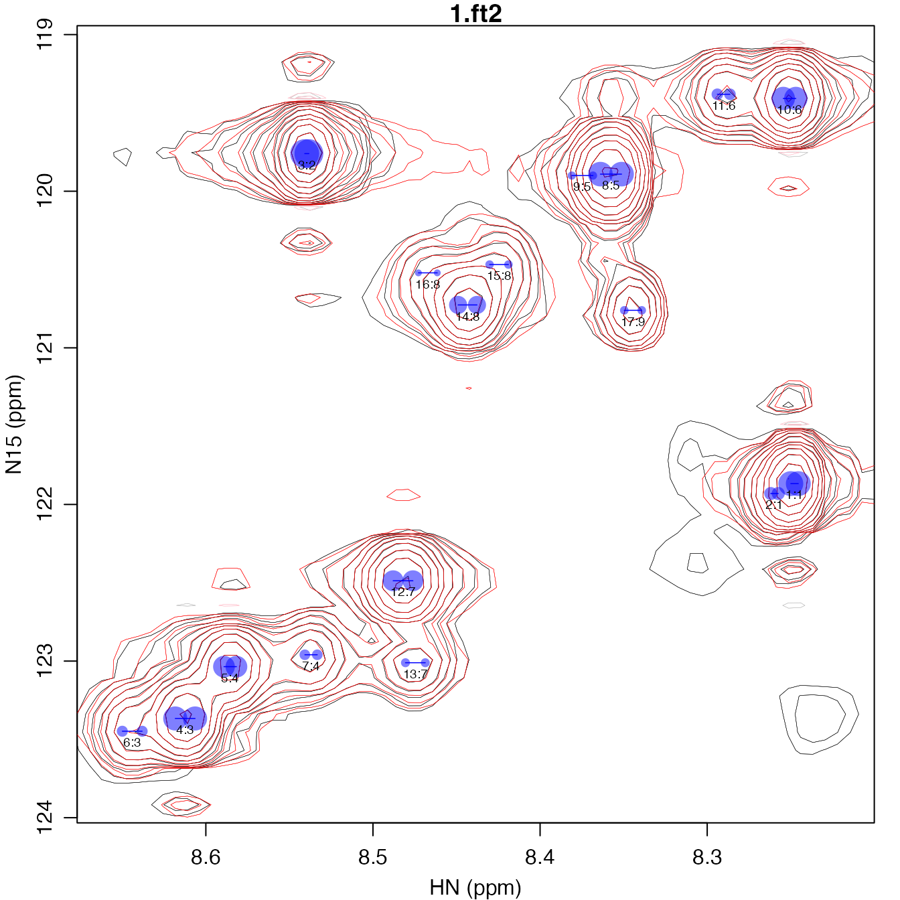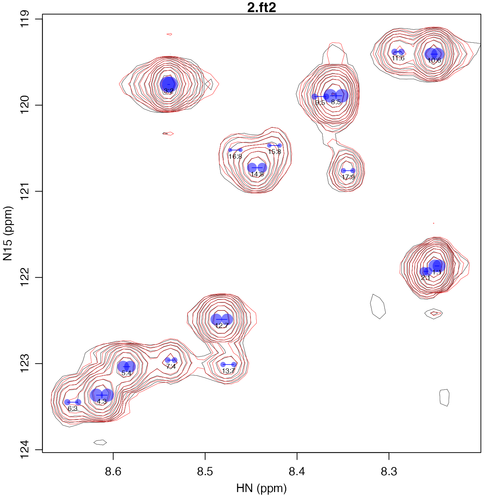

The fit for `2.ft2` looks nearly identical but the peaks are about
fourfold less intense than `1.ft2`. You can tell this because the lowest
contour level in the plot below is slightly narrower than in the plot
above. (Remember that the lowest contour level is drawn at 4x the noise
level for all plots drawn by `plot_peak_df`.)

The peak volumes between the two spectra are highly correlated and have
similar relative ratios, indicating that the T₁ values are for the peaks
are relatively similar.

``` r
xlim <- range(0, extended_peak_df[,"1.ft2"])
ylim <- range(0, extended_peak_df[,"2.ft2"])
plot(extended_peak_df[,c("1.ft2", "2.ft2")], xlim=xlim, ylim=ylim)
abline(lsfit(extended_peak_df[,"1.ft2"], extended_peak_df[,"2.ft2"]), col="red")
```

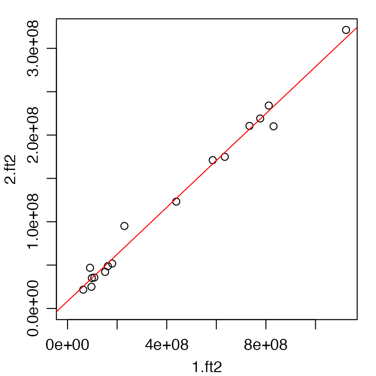

``` r
plot(extended_peak_df[,"2.ft2"]/extended_peak_df[,"1.ft2"], xlab="Peak Number", ylab="Spectrum 2 Volume/Spectrum 1 Volume")
```


