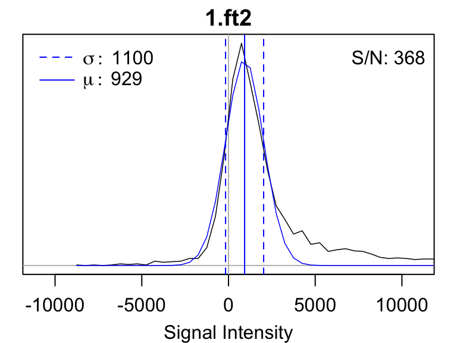
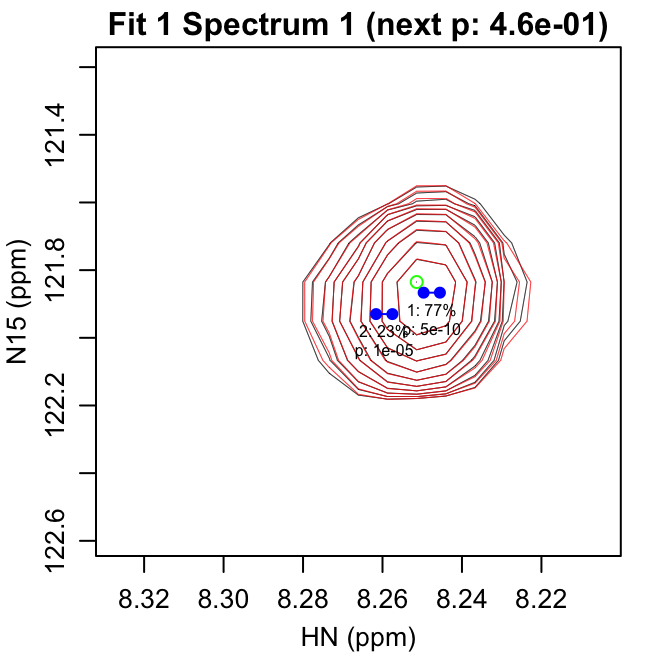
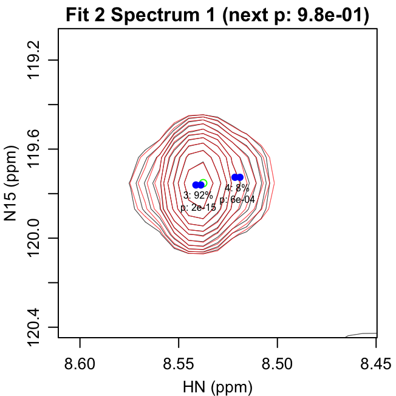
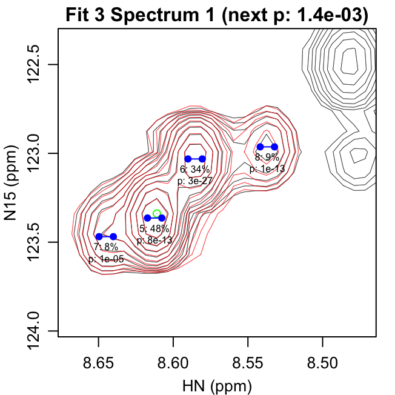
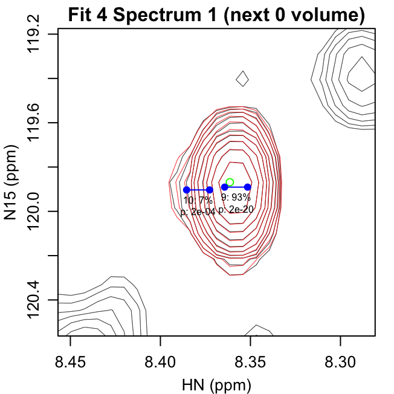
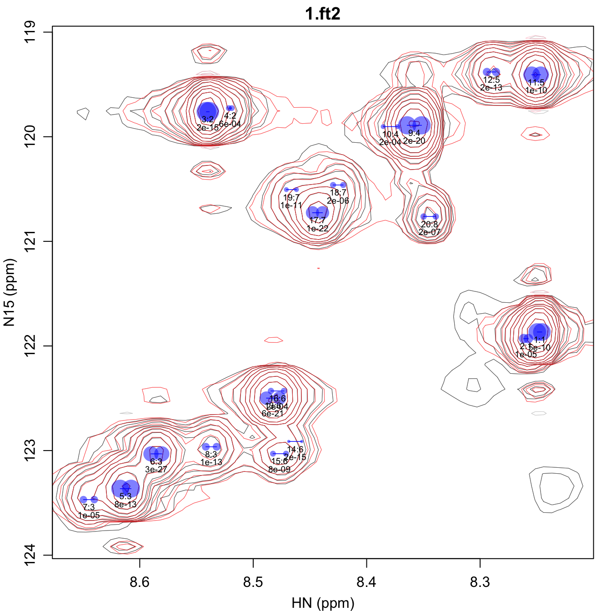
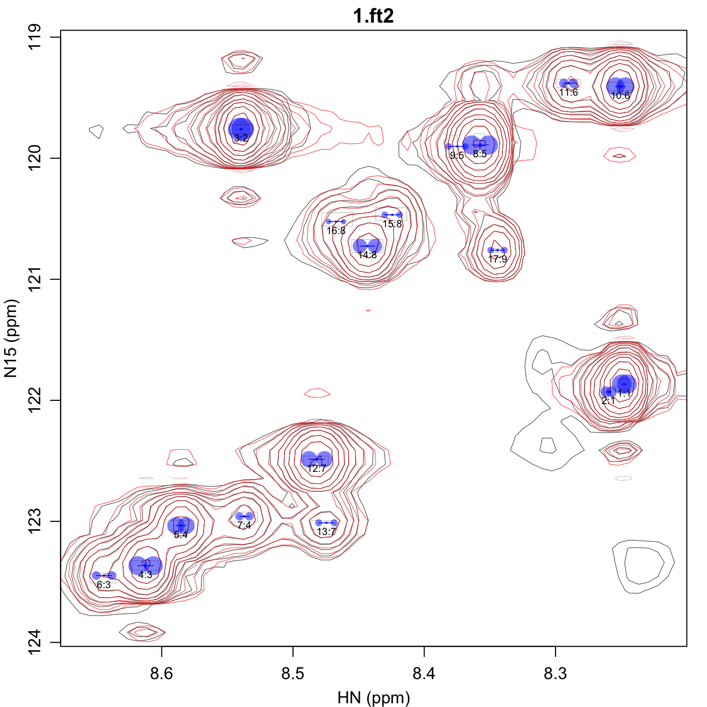
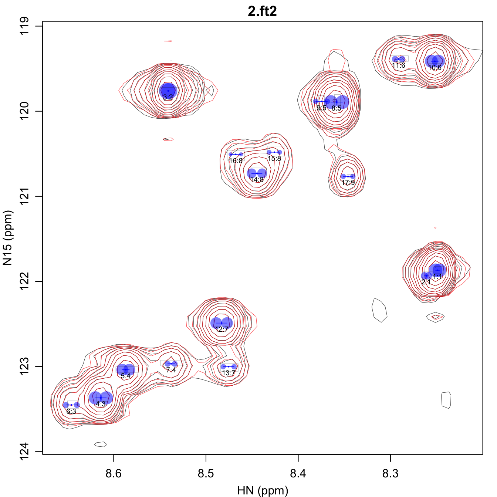
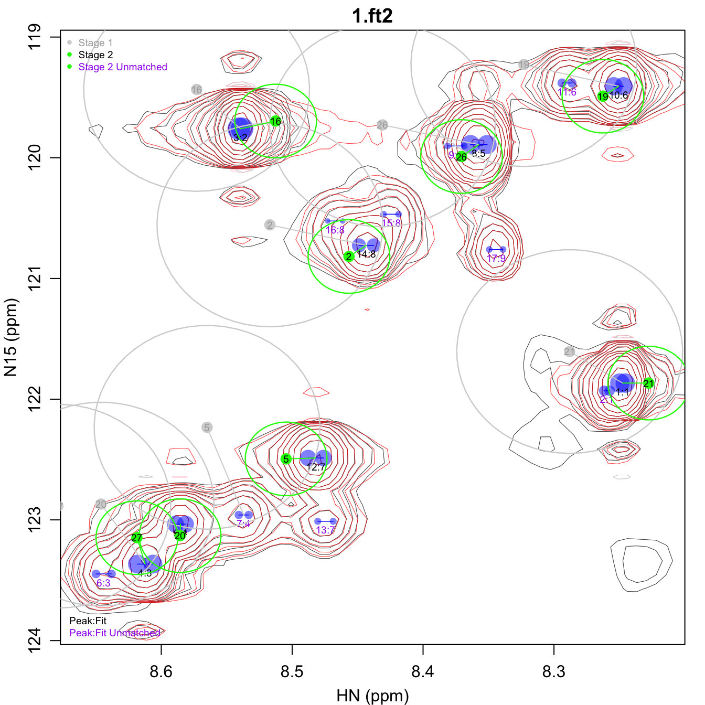
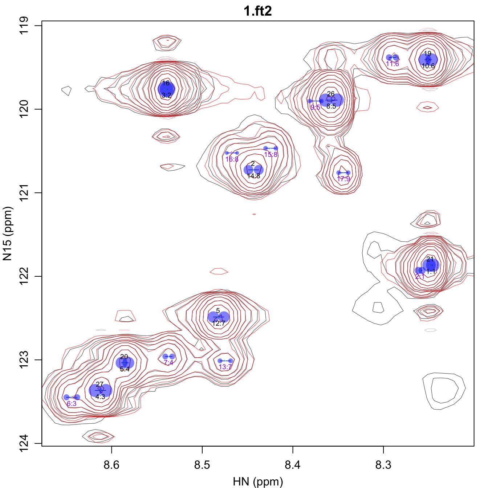

# Automated 2D Peak Fitting Scripts

FitNMR enables fully automated peak fitting of 2D NMR spectra. This
document shows how the 2D fitting can be done with very little manual
code entry using three convenience scripts, `fit_peaks_2d.R`,
`refit_peaks_2d.R`, and `assign_peaks_2d.R`, that are included with
FitNMR. For a description of how a similar workflow can be accomplished
using `R` code and more details about algorithms, see the “Automated 2D
Peak Fitting Code” document. The directory containing the three demo
scripts that will be used here can be found by running the following
from within R:

``` r
system.file("demo", package="fitnmr")
```

For each spectrum, first use NMRPipe to produce an `*.ft2` file. The
data must only be apodized with the `SP` function using an exponent of 1
or 2. In addition, use the `EXT` function to extract the smallest region
that contains all the relevant peaks to be fit. Eliminating noise and
other extraneous peaks speeds up the processing and simplifies the
output.

## Fitting Initial Set of Peaks

The `fit_peaks_2d.R` script in the `fitnmr` `demo` directory handles the
initial fitting of peaks. You would typically use this script to find an
initial set of peaks on the highest signal-to-noise spectrum in your
dataset. The script can be customized by creating a copy then editing
the parameters listed at the top prior to running it in R.

In a typical workflow, you would create a directory to perform the
initial fitting in. Here we will create that directory with R, but
usually you would do so using your file manager, the `mkdir` function,
etc.

``` r
dir.create("fit")
```

Next you need to switch to that directory. If that was successful the
following command should output `fit`:

``` r
basename(getwd())
#> [1] "fit"
```

Next copy the reference spectrum into that directory. That spectrum must
have `.ft2` as the extension, otherwise the script won’t be able to find
it. Ordinarily you would do this manually, but here we will do so in
code. The following copies the first T₁ spectrum into it.

``` r
file.copy(file.path(t1_dir, t1_ft2_filenames[1]), ".")
```

Next we need to make a copy of the `fit_peaks_2d.R` script in the
current working directory, which may be easiest to do within R.

``` r
file.copy(system.file("demo", "fit_peaks_2d.R", package="fitnmr"), ".")
```

You can then customize any of the options at the top of
`fit_peaks_2d.R`:

    # Input Files:
    #  *.ft2: 2D spectra with peaks to be fit

    # Output Files:
    #  fit_volume.csv: peak parameters for joint fit of all *.ft2 files
    #  noise_histograms.pdf: Gaussian fits of baseline intensity histograms for each *.ft2 file
    #  fit_iterations.pdf: contour plots showing the result of each peak fitting iteration
    #  fit_spectra.pdf: contour plots of the peaks fit to each *.ft2 file


    # Fitting Parameters:

    # peak height must be at least this times the noise level for a new fitting iteration
    noise_cutoff <- 15

    # F-test p-value must be less than this value to accept the addition of a new peak
    f_alpha <- 0.001

    # maximum number of peak fitting iterations to run
    iter_max <- 100

    # data +/- these ppm values will be used for fitting (1H and X nuclei, respectively)
    omega0_plus <- c(0.075, 0.75)

    # starting R2 value for the fits
    r2_start <- 5

    # R2 values are constrained to be between these two numbers
    r2_bounds <- c(0.5, 20)

    # starting doublet scalar coupling (1H and X nuclei, respectively), NA for singlet
    sc_start <- c(6, NA)

    # scalar coupling values are constrained to be between these two numbers
    sc_bounds <- c(2, 12)


    # Plotting Parameters:

    # lowest contour in fit_spectra.pdf will be this number times the noise level
    plot_noise_cutoff <- 4

    # scaling factor for fit_spectra.pdf labels
    cex <- 0.6

In this case, we will use the script unmodified. The `fit_peaks_2d.R`
script must be run from within the `fit` directory. As the script runs,
a summary of the fitting progress will be automatically printed to the
screen.

``` r
source("fit_peaks_2d.R")
#> Fit iteration 1:
#>   0 ->  6 fit parameters: F = 333.8 (p = 4.56642e-10)
#>   6 ->  9 fit parameters: F = 64.6 (p = 1.11899e-05)
#> Warning in minpack.lm::nls.lm(fit_par, fit_lower, fit_upper, fn = fit_fn, : lmder: info = -1. Number of iterations has reached `maxiter' == 200.
#>   9 -> 12 fit parameters: F = 1.2 (p = 0.464698)
#>  Terminating search because F-test p-value > 0.001
#> Fit iteration 2:
#>   0 ->  6 fit parameters: F = 734.0 (p = 1.87653e-15)
#>   6 ->  9 fit parameters: F = 14.7 (p = 0.000581712)
#>   9 -> 12 fit parameters: F = 0.1 (p = 0.976358)
#>  Terminating search because F-test p-value > 0.001
#> Fit iteration 3:
#>   0 ->  6 fit parameters: F = 27.7 (p = 7.52698e-13)
#>   6 ->  9 fit parameters: F = 226.0 (p = 2.5923e-27)
#>   9 -> 12 fit parameters: F = 13.3 (p = 1.34241e-05)
#>  12 -> 15 fit parameters: F = 68.7 (p = 1.46797e-13)
#>  15 -> 18 fit parameters: F = 7.0 (p = 0.00144316)
#>  Terminating search because F-test p-value > 0.001
#> Fit iteration 4:
#>   0 ->  6 fit parameters: F = 2022.7 (p = 1.60653e-20)
#>   6 ->  9 fit parameters: F = 14.0 (p = 0.000228688)
#>  Terminating search because fit produced zero volume
#> Fit iteration 5:
#>   0 ->  6 fit parameters: F = 107.8 (p = 9.74212e-11)
#>   6 ->  9 fit parameters: F = 260.6 (p = 2.04021e-13)
#>   9 -> 12 fit parameters: F = 11.0 (p = 0.00161564)
#>  Terminating search because F-test p-value > 0.001
#> Fit iteration 6:
#>   0 ->  6 fit parameters: F = 1219.7 (p = 6.27674e-21)
#>   6 ->  9 fit parameters: F = 174.9 (p = 1.74543e-15)
#>   9 -> 12 fit parameters: F = 42.3 (p = 8.00775e-09)
#>  12 -> 15 fit parameters: F = 11.8 (p = 0.000186865)
#>  15 -> 18 fit parameters: F = 1.6 (p = 0.223018)
#>  Terminating search because F-test p-value > 0.001
#> Fit iteration 7:
#>   0 ->  6 fit parameters: F = 232.0 (p = 1.0692e-22)
#>   6 ->  9 fit parameters: F = 15.9 (p = 1.99824e-06)
#>   9 -> 12 fit parameters: F = 54.3 (p = 1.15821e-11)
#>  Terminating search because fit produced zero volume
#> Fit iteration 8:
#>   0 ->  6 fit parameters: F = 330.9 (p = 1.75035e-07)
#>   6 ->  9 fit parameters: F = 1.8 (p = 0.274918)
#>  Terminating search because F-test p-value > 0.001
```

### Output Files

Four output files are created by `fit_peaks_2d.R`:

- `noise_histograms.pdf`
- `fit_iterations.pdf`
- `fit_spectra.pdf`
- `fit_volume.csv`

`noise_histograms.pdf` gives a histogram of the intensity values for
each of the input spectra. The standard deviation of a Gaussian fit to
that histogram is used to determine the noise level.



`fit_iterations.pdf` shows each iteration of the fitting, with the data
shown in black and the fit contours shown in red. Negative contours are
shown with lighter colors. The starting peak position is indicated with
a green circle at the highest intensity in the spectrum after previous
fits have been subtracted. The blue points show the positions of the
peaks in the modeled doublet.

The title text in parentheses gives the reason the next peak was
rejected: either the p-value for the peak was greater than `f_alpha` or
the peak had 0 volume. The first line of text under each peak gives the
peak number and fraction of the total volume in that iteration. The
second line gives the F-test p-value for that peak.

All peaks in a given iteration are fit with the same peak shape
parameters, including the peak position (`omega0`) and doublet scalar
coupling (`sc`). Those peaks are all assigned to the same fitting group
(`fit`) and continue to share the same peak shape parameters in
subsequent fit optimizations. This parameter sharing can be important
for both accuracy and stability when peaks are highly overlapped. If
desired, you can manually modify the peak grouping in the peak list
comma-separated value (CSV) file to change which peaks share parameters.

The first four pages of `fit_iterations.pdf` are shown here:



`fit_spectra.pdf` gives the fit spectra. The doublet peak positions are
shown with semi-transparent blue dots that are scaled in size such that
the area is proportional to the peak volume. The first line of text
under each peak gives the peak number and the fit group number separated
by a colon. The second line gives the F-test p-value for that peak. By
default, the lowest contour of this spectrum is set to four times the
noise level, but that can be changed using the `plot_noise_cutoff`
script parameter in ‘fit_peaks_2d.R’. Furthermore, the size of the
labels can be controlled using the `cex` (i.e. *c*haracter *ex*pansion)
script parameter.



The `fit_volume.csv` file contains all the identified peaks, the fitting
group for each peak (which in this case is the iteration it was found
in), the peak position/shape parameters, and a column for the volume
found in each spectrum. Only one spectrum has been fit here so only one
column of volumes, ‘1.ft2’, is shown.

| peak | fit | f_pvalue | omega0_ppm_1 | omega0_ppm_2 | sc_hz_1 | r2_hz_1 | r2_hz_2 |      1.ft2 |
|-----:|----:|:---------|-------------:|-------------:|--------:|--------:|--------:|-----------:|
|    1 |   1 | 4.57e-10 |       8.2476 |       121.87 |  3.2806 |  2.9072 | 2.33450 |  824420657 |
|    2 |   1 | 1.12e-05 |       8.2596 |       121.93 |  3.2806 |  2.9072 | 2.33450 |  240560662 |
|    3 |   2 | 1.88e-15 |       8.5400 |       119.76 |  2.0000 |  4.7886 | 2.09965 | 1020008726 |
|    4 |   2 | 5.82e-04 |       8.5202 |       119.73 |  2.0000 |  4.7886 | 2.09965 |   89977216 |
|    5 |   3 | 7.53e-13 |       8.6125 |       123.36 |  7.6481 |  5.2849 | 2.18012 |  848579189 |
|    6 |   3 | 2.59e-27 |       8.5854 |       123.03 |  7.6481 |  5.2849 | 2.18012 |  607904936 |
|    7 |   3 | 1.34e-05 |       8.6449 |       123.47 |  7.6481 |  5.2849 | 2.18012 |  147984411 |
|    8 |   3 | 1.47e-13 |       8.5370 |       122.96 |  7.6481 |  5.2849 | 2.18012 |  161971930 |
|    9 |   4 | 1.61e-20 |       8.3580 |       119.89 | 10.2029 |  2.2306 | 5.03575 |  875241831 |
|   10 |   4 | 2.29e-04 |       8.3791 |       119.90 | 10.2029 |  2.2306 | 5.03575 |   62766713 |
|   11 |   5 | 9.74e-11 |       8.2506 |       119.41 |  6.3683 |  4.9091 | 1.85341 |  732475431 |
|   12 |   5 | 2.04e-13 |       8.2900 |       119.38 |  6.3683 |  4.9091 | 1.85341 |  181301641 |
|   13 |   6 | 6.28e-21 |       8.4826 |       122.50 |  9.1982 |  5.0619 | 2.03464 |  475854299 |
|   14 |   6 | 1.75e-15 |       8.4629 |       122.91 |  9.1982 |  5.0619 | 2.03464 |   28166195 |
|   15 |   6 | 8.01e-09 |       8.4768 |       123.03 |  9.1982 |  5.0619 | 2.03464 |   92626742 |
|   16 |   6 | 1.87e-04 |       8.4786 |       122.43 |  9.1982 |  5.0619 | 2.03464 |  105607485 |
|   17 |   7 | 1.07e-22 |       8.4433 |       120.73 |  7.1444 |  6.3350 | 2.97224 |  460752250 |
|   18 |   7 | 2.00e-06 |       8.4252 |       120.46 |  7.1444 |  6.3350 | 2.97224 |   97674580 |
|   19 |   7 | 1.16e-11 |       8.4663 |       120.51 |  7.1444 |  6.3350 | 2.97224 |   62014526 |
|   20 |   8 | 1.75e-07 |       8.3444 |       120.76 |  8.6176 |  1.9530 | 0.86044 |  105614247 |

## Refining the Initial Fit

The initial fit is done iteratively, so it is usually a good idea to
refine this by editing the fitting groups, deleting extraneous peaks,
and then doing a simultaneous refit of all peaks together with the
`refit_peaks_2d.R` script. We will do this in another directory called
`refine`, which you should create. Here the directory is created using R
code:

``` r
dir.create("refine")
```

Next you need to switch to that directory. If that was successful the
following command should output `refine`:

``` r
basename(getwd())
#> [1] "refine"
```

Then the first spectrum and the `refit_peaks_2d.R` script should be
copied into the `refine` directory:

``` r
file.copy(file.path(t1_dir, t1_ft2_filenames[1]), ".")
file.copy(system.file("demo", "refit_peaks_2d.R", package="fitnmr"), ".")
```

Any of the options at the top of `refit_peaks_2d.R` can then be
customized:

    # Input Files:
    #  start_volume.csv: starting peak parameters for refitting
    #  *.ft2: 2D spectra with peaks to be refit

    # Output Files:
    #  *_volume.csv: refit peak parameters for each *.ft2 file
    #  *_fit.pdf: contour plots of the peaks fit to each *.ft2 file


    # Fitting Parameters:

    # data +/- these ppm values will be used for fitting (1H and X nuclei, respectively)
    omega0_plus <- c(0.075, 0.75)

    # omega0 values are constrained to be within this factor times R2 of the starting omega0
    omega0_r2_factor <- 1.5

    # R2 values are constrained to be between these two numbers
    r2_bounds <- c(0.5, 20)

    # scalar coupling values are constrained to be between these two numbers
    sc_bounds <- c(2, 12)

    # enable refitting of omega0
    fit_omega0 <- TRUE

    # enable refitting of R2
    fit_r2 <- TRUE

    # enable refitting of scalar couplings
    fit_sc <- TRUE

    # enable constraint of peak volume sign
    preserve_m0_sign <- FALSE


    # Plotting Parameters:

    # lowest contour in *_fit.pdf will be this number times the noise level
    plot_noise_cutoff <- 4

    # scaling factor for *_fit.pdf labels
    cex <- 0.6

    # show omega0 constraints imposed by omega0_r2_factor
    plot_omega0_bounds <- TRUE


    # Computing Parameters:

    # number of cores to use for refitting
    mc_cores <- getOption("mc.cores", parallel::detectCores())
    if (.Platform$OS.type == "windows") {
        mc_cores <- 1L
    }

However, in this case the script will be used unmodified. The next step
is to copy the peak list from the `fit` directory to a file called
`start_volume.csv` in the new `refine` directory:

``` r
file.copy(file.path("..", "fit", "fit_volume.csv"), "start_volume.csv")
```

Once that file has been copied, you can then manually change the peak
groups and delete rows for any peaks you want to discard. In this case,
that will be done with the following `R` code, which puts peaks 5 and 7
into a new fitting group, and removes peaks 4, 14, and 16:

``` r
input_table <- read.csv("start_volume.csv", check.names=FALSE)
input_table[c(5,7),"fit"] <- max(input_table[,"fit"])+1
input_table <- input_table[-c(4,14,16),]
write.csv(input_table, "start_volume.csv", row.names=FALSE)
```

The final step is to call the `refit_peaks_2d.R` script from within the
`refine` directory:

``` r
source("refit_peaks_2d.R")
#> Fitting m0 for spectrum 1.ft2...
#> Fitting omega0,sc,r2,m0 for spectrum 1.ft2...
```

The `refit_peaks_2d.R` script first optimizes the volumes, keeping all
other parameters fixed, then optimizes the volumes along with whatever
other variables the user specifies in the script. Also, unlike the
refinement done in “Automated 2D Peak Fitting Code”, `refit_peaks_2d.R`
only fits a single spectrum at a time. This avoids two problems:

1.  For many experiments in which a series of spectra are acquired,
    different amounts of applied power can result in subtle shifts of
    the temperature/peak positions. Especially for overlapping peaks,
    this can cause systematic variations in the volumes. Allowing each
    spectrum to have slightly different peak positions within a small
    region around the starting values helps avoid this problem.
2.  When many spectra are fit simultaneously, the memory usage for
    FitNMR can grow very large. This will hopefully be fixed in a future
    update.

### Output Files

The `refit_peaks_2d.R` script creates two files for each spectrum:

- `*_fit.pdf`
- `*_volume.csv`

In practice, each ’\*’ will be replaced by the spectrum filename.

`*_fit.pdf` shows the overall spectrum as described above. In addition,
it also shows the constraints on the `omega0` parameters using gray
rectangles, the size of which is determined by the `omega0_r2_factor`
parameter. The central peak position, shown as a small blue dot, is
constrained to be within that gray rectangle.



`*_volume.csv` contains all the identified peaks, along with a column
for the volume found in that spectrum.

| peak | fit | omega0_ppm_1 | omega0_ppm_2 | sc_hz_1 | r2_hz_1 | r2_hz_2 |      1.ft2 |
|-----:|----:|-------------:|-------------:|--------:|--------:|--------:|-----------:|
|    1 |   1 |       8.2476 |       121.87 |  3.3463 |  2.8966 | 2.31700 |  823653059 |
|    2 |   1 |       8.2596 |       121.93 |  3.3463 |  2.8966 | 2.31700 |  239523996 |
|    3 |   2 |       8.5395 |       119.76 |  2.0000 |  5.6996 | 2.07427 | 1120612478 |
|    4 |   3 |       8.6123 |       123.37 |  9.4647 |  3.2950 | 2.36758 |  777523259 |
|    5 |   4 |       8.5853 |       123.04 |  6.0587 |  6.5823 | 1.79531 |  632568162 |
|    6 |   3 |       8.6439 |       123.45 |  9.4647 |  3.2950 | 2.36758 |  163968345 |
|    7 |   4 |       8.5370 |       122.96 |  6.0587 |  6.5823 | 1.79531 |  151176240 |
|    8 |   5 |       8.3575 |       119.89 | 10.1581 |  1.7366 | 4.73950 |  803422420 |
|    9 |   5 |       8.3749 |       119.90 | 10.1581 |  1.7366 | 4.73950 |   96583110 |
|   10 |   6 |       8.2506 |       119.41 |  6.0938 |  5.0267 | 1.77685 |  731301051 |
|   11 |   6 |       8.2901 |       119.38 |  6.0938 |  5.0267 | 1.77685 |  180469307 |
|   12 |   7 |       8.4819 |       122.49 |  9.4013 |  5.0804 | 2.41291 |  587357774 |
|   13 |   7 |       8.4745 |       123.01 |  9.4013 |  5.0804 | 2.41291 |  108283128 |
|   14 |   8 |       8.4433 |       120.73 |  9.1220 |  4.8623 | 3.19661 |  436467804 |
|   15 |   8 |       8.4244 |       120.47 |  9.1220 |  4.8623 | 3.19661 |   95394070 |
|   16 |   8 |       8.4672 |       120.52 |  9.1220 |  4.8623 | 3.19661 |   64410529 |
|   17 |   9 |       8.3442 |       120.76 |  8.3984 |  1.5894 | 0.91155 |   97879390 |

## Extending the Fit to Other Spectra

To extend the refined fit to a series of other spectra, we will create
another directory called `extend`.

``` r
dir.create("extend", FALSE)
```

Next you need to switch to that directory. If that was successful the
following command should output `extend`:

``` r
basename(getwd())
#> [1] "extend"
```

We will then copy both T₁ spectra into it. In addition, the fit
parameter CSV file output from the refinement step will be copied to the
file `start_volume.csv` for use as input.

``` r
file.copy(file.path(t1_dir, t1_ft2_filenames), ".")
file.copy(file.path("..", "refine", "1_volume.csv"), "start_volume.csv")
```

We will also need to copy the `refit_peaks_2d.R` script into the
`extend` directory:

``` r
file.copy(system.file("demo", "refit_peaks_2d.R", package="fitnmr"), ".")
```

However, when extending the fit to other spectra, the parameters
determining the peak shape (`sc` and `r2`) will be fixed, allowing only
the volume and peak position to vary. This is done by changing `fit_sc`
and `fit_r2` to `FALSE` at the top of the `refit_peaks_2d.R` script,
which can be done using a text editor. For the purposes of this
demonstration, the two parameters are changed with the following code:

``` r
script_lines <- readLines("refit_peaks_2d.R")
script_lines <- sub("fit_sc <- TRUE", "fit_sc <- FALSE", script_lines)
script_lines <- sub("fit_r2 <- TRUE", "fit_r2 <- FALSE", script_lines)
writeLines(script_lines, "refit_peaks_2d.R")
```

The part of the script controlling the parameters to be fit should now
read:

    # enable refitting of omega0
    fit_omega0 <- TRUE

    # enable refitting of R2
    fit_r2 <- FALSE

    # enable refitting of scalar couplings
    fit_sc <- FALSE

Next, run `refit_peaks_2d.R` from within the `extend` directory. It will
do the refitting for each spectrum on a different CPU core, reducing the
total time taken to fit a large number of spectra.

``` r
source("refit_peaks_2d.R")
```

### Output Files

As in the refinement step, the script creates two files for each
spectrum, whose names are derived from the spectrum filenames. Here the
output associated with `2.ft2` is shown, as the output for `1.ft2` is
very similar to the previous section.

`*_fit.pdf` shows the overall spectrum. Pay particular attention to
where the small blue circle is located in the gray rectangle. You may
want to adjust `omega0_r2_factor` to increase or decrease the stringency
of the `omega0` constraint, or possibly choose a different spectrum to
use for `start_volume.csv`.



`*_volume.csv` contains all the identified peaks, along with a column
for the volume found in that spectrum.

| peak | fit | omega0_ppm_1 | omega0_ppm_2 | sc_hz_1 | r2_hz_1 | r2_hz_2 |     2.ft2 |
|-----:|----:|-------------:|-------------:|--------:|--------:|--------:|----------:|
|    1 |   1 |       8.2491 |       121.87 |  3.3463 |  2.8966 | 2.31700 | 231872819 |
|    2 |   1 |       8.2612 |       121.93 |  3.3463 |  2.8966 | 2.31700 |  67997595 |
|    3 |   2 |       8.5409 |       119.76 |  2.0000 |  5.6996 | 2.07427 | 321746353 |
|    4 |   3 |       8.6139 |       123.37 |  9.4647 |  3.2950 | 2.36758 | 220800433 |
|    5 |   4 |       8.5869 |       123.04 |  6.0587 |  6.5823 | 1.79531 | 176274429 |
|    6 |   3 |       8.6458 |       123.45 |  9.4647 |  3.2950 | 2.36758 |  44076003 |
|    7 |   4 |       8.5377 |       122.97 |  6.0587 |  6.5823 | 1.79531 |  43199279 |
|    8 |   5 |       8.3584 |       119.89 | 10.1581 |  1.7366 | 4.73950 | 238007135 |
|    9 |   5 |       8.3748 |       119.88 | 10.1581 |  1.7366 | 4.73950 |  36138286 |
|   10 |   6 |       8.2520 |       119.41 |  6.0938 |  5.0267 | 1.77685 | 211286779 |
|   11 |   6 |       8.2913 |       119.39 |  6.0938 |  5.0267 | 1.77685 |  49843412 |
|   12 |   7 |       8.4830 |       122.49 |  9.4013 |  5.0804 | 2.41291 | 171865386 |
|   13 |   7 |       8.4754 |       123.00 |  9.4013 |  5.0804 | 2.41291 |  36056767 |
|   14 |   8 |       8.4448 |       120.73 |  9.1220 |  4.8623 | 3.19661 | 122206500 |
|   15 |   8 |       8.4259 |       120.48 |  9.1220 |  4.8623 | 3.19661 |  28602978 |
|   16 |   8 |       8.4677 |       120.51 |  9.1220 |  4.8623 | 3.19661 |  19245838 |
|   17 |   9 |       8.3460 |       120.77 |  8.3984 |  1.5894 | 0.91155 |  35368718 |

## Transferring Assignments

FitNMR can also transfer previously determined peak assignments onto the
peak lists. This will be done in the `extend` directory used above. For
this tutorial, assignments for the subregion of the spectrum are also
provided, which should be copied into that directory and given the name
`assignments.csv` using:

``` r
file.copy(system.file("extdata", "t1", "assignments.csv", package="fitnmr"), ".")
```

The `assignments.csv` file should contain a header and three columns.
The text in the header is ignored, but the order of the columns must be:

1.  Peak identifier
2.  PPM in dimension 1
3.  PPM in dimension 2

The `assignments.csv` file used here contains eight peaks:

| res | hn_ppm |  n_ppm |
|----:|-------:|-------:|
|   2 |  8.517 | 120.56 |
|   5 |  8.565 | 122.23 |
|  16 |  8.573 | 119.43 |
|  19 |  8.323 | 119.23 |
|  20 |  8.646 | 122.87 |
|  21 |  8.288 | 121.61 |
|  26 |  8.431 | 119.73 |
|  27 |  8.679 | 122.89 |

The script that transfers the assignments is called `assign_peaks_2d.R`
and should also be copied into the `extend` directory:

``` r
file.copy(system.file("demo", "assign_peaks_2d.R", package="fitnmr"), ".")
```

There are a number of parameters at the top of that script that can be
customized:

    # Input Files:
    #  assignments.csv: assignments to transfer to *_volume.csv files
    #  *_volume.csv: peak parameters to be assigned (each must have same number of peaks)
    #  *.ft2: 2D spectra associated with each *_volume.csv file
    #  start_volume.csv (optional): *_volume.csv file most similar to this used for assignment

    # Output Files
    #  assign_volume.csv: assigned peaks, median parameters, and aggregated volumes
    #  assign_stages.pdf: contour plot showing both assignment stages
    #  assign_omegas.pdf: contour plot showing final peak assignments


    # Assignment Parameters:

    # peak assignment stage 1 adjustment (for first and second dimensions, respectively)
    cs_adj_1 <- c(0, 0)

    # peak assignment stage 1 distance threshold (fraction of chemical shift range)
    thresh_1 <- 0.1

    # peak assignment stage 1 adjustment (for first and second dimensions, respectively)
    cs_adj_2 <- c(0, 0)

    # peak assignment stage 2 distance threshold (fraction of chemical shift range)
    thresh_2 <- 0.025


    # Plotting Parameters:

    # lowest contour in *_fit.pdf will be this number times the noise level
    plot_noise_cutoff <- 4

    # scaling factor for fit_spectra.pdf labels
    cex <- 0.2

    # plot ovals showing the thresholds for peak assignment transfer
    plot_thresh <- TRUE

    # color for unmatched peaks/assignments
    unmatched_col <- "purple"

The assignment transfer uses a FitNMR function called
[`height_assign()`](https://smith-group.github.io/fitnmr/reference/height_assign.md)
that goes through each peak in the spectrum in order of decreasing
height/volume, and assigns it to the closest position in the assignment
list that is within some threshold distance. Internally, the chemical
shifts in each dimension are normalized by the range of values in that
dimension. The threshold is given in those normalized units, such that a
value of 0.1 would allow a difference of no more than 10% of the
spectral width in each dimension, or less for diagonally adjacent peaks.
The algorithm does not assign multiple peaks to the same identifier.

To help automatically handle differences in referencing between the
spectra and input assignments, the algorithm uses
[`height_assign()`](https://smith-group.github.io/fitnmr/reference/height_assign.md)
in two different stages. The first stage uses a larger threshold to
handle cases where the referencing is quite different. After that
initial assignment, the median offsets between the spectra and input
assignments (in each dimension) are used to shift the input assignments.
As long as there are enough isolated peaks that can be correctly
assigned in the first stage, this is often sufficient to automatically
correct the referencing for a more stringent second stage. The
thresholds for both stages (`thresh_1` and `thresh_2`) can be tailored
individually. In addition, the assigned chemical shifts can be manually
adjusted for each stage (using `cs_adj_1` and `cs_adj_2`) to help in
cases where the referencing cannot be automatically corrected.

Because this is a subspectrum, the default values for the thresholds do
not work as well. Furthermore, while the whole spectrum has enough peaks
to automatically determine the correct offset after stage 1, the
subspectrum does not, so the proton assignments are manually shifted
0.02 ppm to the left to compensate. For this tutorial, that is done with
the following code:

``` r
script_lines <- readLines("assign_peaks_2d.R")
script_lines <- sub("thresh_1 <- 0.1", "thresh_1 <- 0.2", script_lines)
script_lines <- sub("cs_adj_2 <- c\\(0, 0\\)", "cs_adj_2 <- c(-0.02, 0)", script_lines)
script_lines <- sub("thresh_2 <- 0.025", "thresh_2 <- 0.075", script_lines)
writeLines(script_lines, "assign_peaks_2d.R")
```

The modified part of the script should now read:

    # peak assignment stage 1 distance threshold (fraction of chemical shift range)
    thresh_1 <- 0.2

    # peak assignment stage 1 adjustment (for first and second dimensions, respectively)
    cs_adj_2 <- c(-0.02, 0)

    # peak assignment stage 2 distance threshold (fraction of chemical shift range)
    thresh_2 <- 0.075

The `assign_peaks_2d.R` script should then be run from within the
`extend` directory:

``` r
source("assign_peaks_2d.R")
```

### Output Files

Three output files are generated by the `assign_peaks_2d.R` script:

- `assign_stages.pdf`
- `assign_omegas.pdf`
- `assign_volume.csv`

`assign_stages.pdf` shows the two stages used for the assignment
transfer. The gray points show the chemical shifts of the input
assignments after `cs_adj_1` has been applied. The peaks matched to
those assignments in stage 1 are connected by gray lines. A larger gray
oval around each input assignment shows the size of `thresh_1`. The
adjusted input assignment chemical shifts used for stage 2 are shown in
green, with smaller ovals indicating a more stringent `thresh_2`. Any
input assignment not matched to a peak has its label drawn in purple.
Likewise, any peak not matched to an input assignment is labeled in
purple.



`assign_omegas.pdf` shows the final results of the assignment transfer,
with the identifier of an assigned peak shown above the peak, and
unassigned peaks labeled in purple. In addition, the peak positions from
all of the fit spectra are shown as very small points, which are
difficult to see here and are best viewed by zooming into the PDF
generated by this step. An attempt is made to color each peak in a given
group differently.



`assign_volume.csv` contains all the peaks, with the assigned identifier
in the first column. The peak positions, scalar couplings, and
relaxation rates in this table give the median values from all the
individual fits. There is also a column for the volume found in each
spectrum.

| assignment | peak | fit | omega0_ppm_1 | omega0_ppm_2 | sc_hz_1 | r2_hz_1 | r2_hz_2 | 1.ft2 | 2.ft2 |
|:---|---:|---:|---:|---:|---:|---:|---:|---:|---:|
| 21 | 1 | 1 | 8.2484 | 121.87 | 3.3463 | 2.8966 | 2.31700 | 823654203 | 231872819 |
|  | 2 | 1 | 8.2604 | 121.93 | 3.3463 | 2.8966 | 2.31700 | 239522805 | 67997595 |
| 16 | 3 | 2 | 8.5402 | 119.76 | 2.0000 | 5.6996 | 2.07427 | 1120538907 | 321746353 |
| 27 | 4 | 3 | 8.6131 | 123.37 | 9.4647 | 3.2950 | 2.36758 | 777522598 | 220800433 |
| 20 | 5 | 4 | 8.5861 | 123.04 | 6.0587 | 6.5823 | 1.79531 | 632568971 | 176274429 |
|  | 6 | 3 | 8.6449 | 123.45 | 9.4647 | 3.2950 | 2.36758 | 163968675 | 44076003 |
|  | 7 | 4 | 8.5373 | 122.96 | 6.0587 | 6.5823 | 1.79531 | 151175459 | 43199279 |
| 26 | 8 | 5 | 8.3579 | 119.89 | 10.1581 | 1.7366 | 4.73950 | 802920758 | 238007135 |
|  | 9 | 5 | 8.3748 | 119.89 | 10.1581 | 1.7366 | 4.73950 | 97111602 | 36138286 |
| 19 | 10 | 6 | 8.2513 | 119.41 | 6.0938 | 5.0267 | 1.77685 | 731306564 | 211286779 |
|  | 11 | 6 | 8.2907 | 119.38 | 6.0938 | 5.0267 | 1.77685 | 180469286 | 49843412 |
| 5 | 12 | 7 | 8.4825 | 122.49 | 9.4013 | 5.0804 | 2.41291 | 587358952 | 171865386 |
|  | 13 | 7 | 8.4750 | 123.01 | 9.4013 | 5.0804 | 2.41291 | 108283049 | 36056767 |
| 2 | 14 | 8 | 8.4441 | 120.73 | 9.1220 | 4.8623 | 3.19661 | 436473368 | 122206500 |
|  | 15 | 8 | 8.4252 | 120.47 | 9.1220 | 4.8623 | 3.19661 | 95383740 | 28602978 |
|  | 16 | 8 | 8.4674 | 120.52 | 9.1220 | 4.8623 | 3.19661 | 64431478 | 19245838 |
|  | 17 | 9 | 8.3451 | 120.76 | 8.3984 | 1.5894 | 0.91155 | 97878091 | 35368718 |
