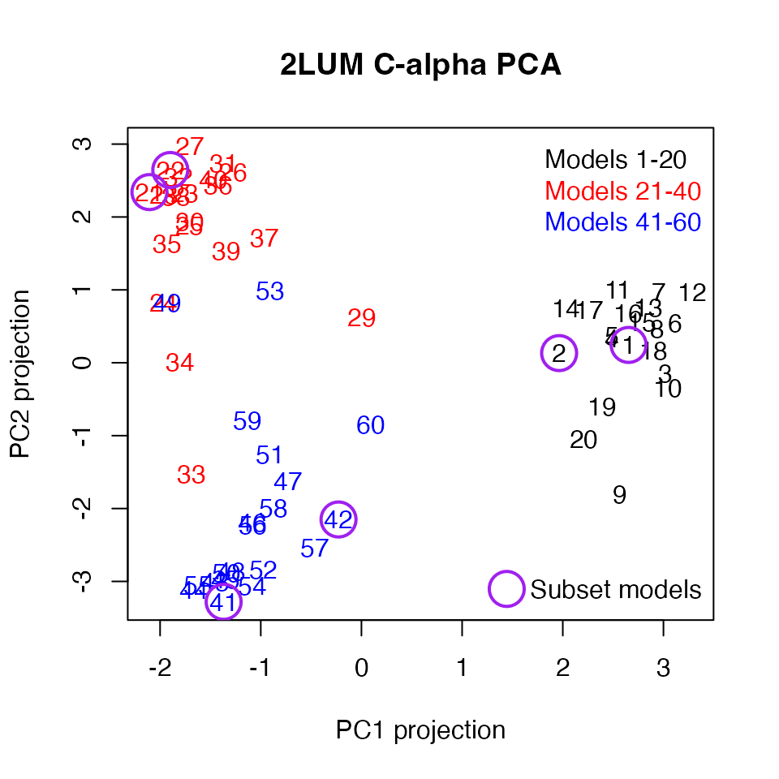
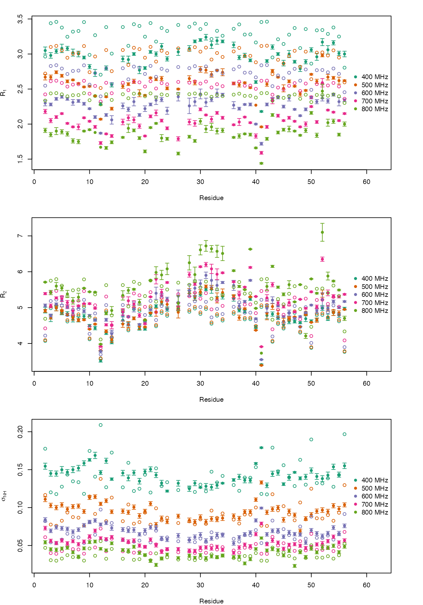
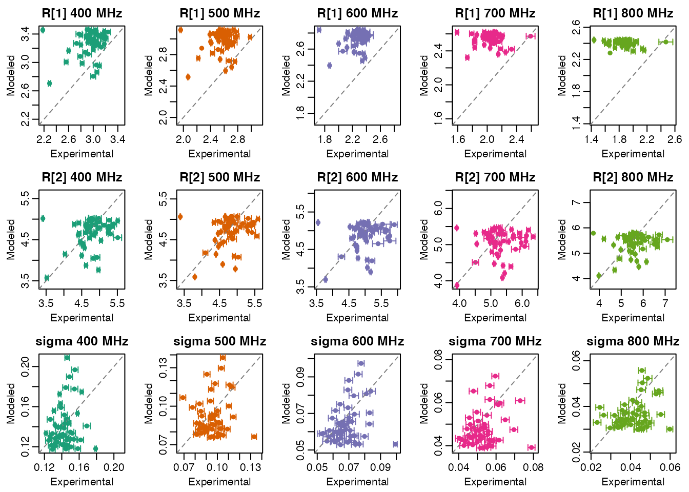

# GB3 Kinetic Ensemble Analysis

## Datasets

### 2LUM Three-State Ensemble

The [2LUM](https://www.rcsb.org/structure/2LUM) 60-member GB3 ensemble
was generated by joint refinement of three-state ensembles to eNOE,
scalar coupling, and RDC data as described in [Vögeli
2012](https://doi.org/10.1038/nsmb.2355). There are two versions of the
2LUM ensemble included with the `ke` package. One contains all C-alpha
atoms of the 60-member ensemble. The other contains all atoms of just
models 1, 2, 21, 22, 41, and 42. They are read into three-dimensional
coordinate arrays, with the first dimension representing x/y/z, the
second representing atoms, and the third representing the models:

``` r
library(ke)

ca_file <- system.file("extdata", "gb3", "2lum_ca.pdb.gz", package = "ke")
ca_coord <- read_ensemble(ca_file)
str(ca_coord)
#>  num [1:3, 1:56, 1:60] 2.093 -0.001 -1.242 5.484 1.247 ...
#>  - attr(*, "dimnames")=List of 3
#>   ..$ : NULL
#>   ..$ : chr [1:56] " CA  MET A   1 " " CA  GLN A   2 " " CA  TYR A   3 " " CA  LYS A   4 " ...
#>   ..$ : chr [1:60] "M1" "M2" "M3" "M4" ...
subset_file <- system.file("extdata", "gb3", "2lum_subset.pdb.gz", package = "ke")
subset_coord <- read_ensemble(subset_file)
str(subset_coord)
#>  num [1:3, 1:859, 1:6] 1.329 0 0 2.093 -0.001 ...
#>  - attr(*, "dimnames")=List of 3
#>   ..$ : NULL
#>   ..$ : chr [1:859] " N   MET A   1 " " CA  MET A   1 " " C   MET A   1 " " O   MET A   1 " ...
#>   ..$ : chr [1:6] "M1" "M2" "M3" "M4" ...
subset_models <- c(1, 2, 21, 22, 41, 42)
```

The following carries out a principal components analysis on the C-alpha
atoms and projects them onto the first two principal components.

``` r
ca_matrix <- t(apply(ca_coord, 3, c))
ca_matrix <- scale(ca_matrix, center = TRUE, scale = FALSE)

ca_pca <- eigen(cov(ca_matrix))
ca_proj <- ca_matrix %*% ca_pca$vectors[, 1:2]
```

The first two principal component projections can be plotted, revealing
reasonably distinct states.

``` r
model_col <- c(rep("black", 20), rep("red", 20), rep("blue", 20))
plot(ca_proj[, 1], ca_proj[, 2], xlab = "PC1 projection", ylab = "PC2 projection",
     main = "2LUM C-alpha PCA", type = "n")
text(ca_proj[, 1], ca_proj[, 2], labels = 1:60, col = model_col)
points(ca_proj[subset_models, 1], ca_proj[subset_models, 2], 
       pch = 1, col = "purple", cex = 3, lwd = 2)
legend("topright", legend = c("Models 1-20", "Models 21-40", "Models 41-60"), 
       text.col = c("black", "red", "blue"), bty = "n")
legend("bottomright", legend = "Subset models", col = "purple", 
       pch = 1, pt.cex = 3, pt.lwd = 2, bty = "n")
```



The six models included in `2lum_subset.pdb.gz` are circled in purple
above. Working under the assumption that models refined together have
numbers separated by 20, those should be the first two three-state
ensembles.

### ¹⁵N Backbone Relaxation Data

The `hall2006` directory contains GB3 ¹⁵N backbone relaxation data
reported by [Hall 2006](https://doi.org/10.1021/ja060406x): longitudinal
relaxation rates (`R1.csv`), transverse relaxation rates (`R2.csv`), and
steady-state heteronuclear NOE values (`NOE.csv`). Each file contains
one row per residue, with measured values and associated uncertainties
at five proton spectrometer frequencies ranging from approximately 400
to 800 MHz (9.4-18.8 T, respectively).

``` r
hall2006_dir <- system.file("extdata", "gb3", "hall2006", package = "ke")

r1 <- read.csv(file.path(hall2006_dir, "R1.csv"))
r2 <- read.csv(file.path(hall2006_dir, "R2.csv"))
noe <- read.csv(file.path(hall2006_dir, "NOE.csv"))

str(r1)
#> 'data.frame':    51 obs. of  11 variables:
#>  $ residue     : int  2 3 4 5 6 7 8 9 10 11 ...
#>  $ R1_9.4T     : num  3.05 2.98 3.04 3.08 3.08 3.02 3 2.95 2.82 2.73 ...
#>  $ R1_err_9.4T : num  0.05 0.04 0.03 0.06 0.03 0.05 0.04 0.02 0.03 0.05 ...
#>  $ R1_11.7T    : num  2.67 2.67 2.74 2.69 2.61 2.63 2.58 2.53 2.54 2.4 ...
#>  $ R1_err_11.7T: num  0.04 0.03 0.02 0.02 0.02 0.01 0.01 0.01 0.01 0.01 ...
#>  $ R1_14.1T    : num  2.3 2.28 2.36 2.39 2.36 2.31 2.33 2.29 2.22 2.1 ...
#>  $ R1_err_14.1T: num  0.04 0.02 0.02 0.02 0.02 0.04 0.02 0.02 0.01 0.02 ...
#>  $ R1_16.4T    : num  2.18 2.05 2.1 2.15 2.01 1.96 1.96 2.09 2.04 1.96 ...
#>  $ R1_err_16.4T: num  0.03 0.03 0.02 0.01 0.01 0.01 0.04 0.01 0.01 0.02 ...
#>  $ R1_18.8T    : num  1.91 1.85 1.9 1.89 1.86 1.76 1.75 1.9 1.92 1.88 ...
#>  $ R1_err_18.8T: num  0.03 0.03 0.05 0.03 0.03 0.03 0.03 0.01 0.01 0 ...
str(r2)
#> 'data.frame':    51 obs. of  11 variables:
#>  $ residue     : int  2 3 4 5 6 7 8 9 10 11 ...
#>  $ R2_9.4T     : num  4.93 4.71 4.98 4.87 4.83 4.67 4.67 4.76 4.5 4.43 ...
#>  $ R2_err_9.4T : num  0.08 0.1 0.07 0.07 0.06 0.07 0.07 0.06 0.03 0.05 ...
#>  $ R2_11.7T    : num  4.91 4.73 4.99 4.92 4.81 4.72 4.65 4.66 4.4 4.54 ...
#>  $ R2_err_11.7T: num  0.04 0.05 0.08 0.1 0.03 0.07 0.04 0.02 0.01 0.01 ...
#>  $ R2_14.1T    : num  5.06 4.78 5.1 5.2 5.02 4.85 5.02 4.9 4.78 4.65 ...
#>  $ R2_err_14.1T: num  0.04 0.04 0.03 0.11 0.05 0.06 0.05 0.04 0.03 0.03 ...
#>  $ R2_16.4T    : num  5.39 5.05 5.27 5.25 5.14 4.91 5.05 5.11 5.11 4.98 ...
#>  $ R2_err_16.4T: num  0.03 0.05 0.03 0.08 0.06 0.13 0.02 0.01 0.02 0.02 ...
#>  $ R2_18.8T    : num  5.71 5.42 5.6 5.54 5.38 5.19 5.29 5.54 5.44 5.43 ...
#>  $ R2_err_18.8T: num  0.01 0.06 0.1 0.07 0.1 0.09 0.11 0.01 0.01 0.01 ...
str(noe)
#> 'data.frame':    51 obs. of  11 variables:
#>  $ residue      : int  2 3 4 5 6 7 8 9 10 11 ...
#>  $ NOE_9.4T     : num  0.5 0.52 0.53 0.52 0.53 0.51 0.5 0.47 0.43 0.39 ...
#>  $ NOE_err_9.4T : num  0.01 0.01 0.01 0.01 0.01 0.01 0.01 0.01 0 0.01 ...
#>  $ NOE_11.7T    : num  0.59 0.62 0.64 0.62 0.63 0.62 0.61 0.63 0.56 0.53 ...
#>  $ NOE_err_11.7T: num  0.01 0.01 0.01 0.01 0.01 0.01 0.01 0.01 0.01 0.01 ...
#>  $ NOE_14.1T    : num  0.64 0.7 0.69 0.7 0.7 0.71 0.7 0.67 0.64 0.61 ...
#>  $ NOE_err_14.1T: num  0.01 0.01 0.01 0.01 0.01 0.01 0.01 0.01 0.01 0.01 ...
#>  $ NOE_16.4T    : num  0.67 0.73 0.75 0.74 0.74 0.72 0.74 0.74 0.7 0.65 ...
#>  $ NOE_err_16.4T: num  0.01 0.01 0.01 0.01 0.01 0.01 0.01 0.01 0.01 0.01 ...
#>  $ NOE_18.8T    : num  0.72 0.76 0.77 0.76 0.75 0.77 0.8 0.76 0.72 0.71 ...
#>  $ NOE_err_18.8T: num  0.01 0.01 0.01 0.01 0.01 0.01 0.01 0.01 0.01 0.01 ...
```

The steady-state heteronuclear NOE values can be combined with the
corresponding `R1` values to estimate sigma cross-relaxation rates. For
example, the following code constructs a sigma data frame in the same
wide format as the `R1`, `R2`, and `NOE` tables.

``` r
field_labels <- c("9.4T", "11.7T", "14.1T", "16.4T", "18.8T")

sigma <- data.frame(residue = r1$residue)

for (field in field_labels) {
  sigma_field <- noe_to_sigma(
    noe = noe[[paste0("NOE_", field)]],
    r1 = r1[[paste0("R1_", field)]],
    dnoe = noe[[paste0("NOE_err_", field)]],
    dr1 = r1[[paste0("R1_err_", field)]]
  )
  sigma[[paste0("sigma_", field)]] <- sigma_field[, "sigma"]
  sigma[[paste0("sigma_err_", field)]] <- sigma_field[, "sigma_err"]
}

str(sigma)
#> 'data.frame':    51 obs. of  11 variables:
#>  $ residue        : int  2 3 4 5 6 7 8 9 10 11 ...
#>  $ sigma_9.4T     : num  0.155 0.145 0.145 0.15 0.147 ...
#>  $ sigma_err_9.4T : num  0.004 0.00359 0.0034 0.00427 0.00343 ...
#>  $ sigma_11.7T    : num  0.111 0.1028 0.1 0.1036 0.0979 ...
#>  $ sigma_err_11.7T: num  0.00318 0.00294 0.00287 0.00283 0.00275 ...
#>  $ sigma_14.1T    : num  0.0839 0.0693 0.0742 0.0727 0.0718 ...
#>  $ sigma_err_14.1T: num  0.00275 0.00239 0.00247 0.0025 0.00247 ...
#>  $ sigma_16.4T    : num  0.0729 0.0561 0.0532 0.0567 0.053 ...
#>  $ sigma_err_16.4T: num  0.00243 0.00223 0.00219 0.0022 0.00205 ...
#>  $ sigma_18.8T    : num  0.0542 0.045 0.0443 0.046 0.0471 ...
#>  $ sigma_err_18.8T: num  0.00211 0.00201 0.00225 0.00205 0.00203 ...
```

## Input Data

### ¹⁵N Backbone Relaxation Data

To construct relaxation input for the subset ensemble, the Hall 2006
residue tables can be matched to backbone amide N-H pairs in
`subset_coord`. The first step is to identify which backbone amide N-H
pairs are present in the subset ensemble and keep only those residue
numbers that overlap the Hall 2006 relaxation tables.

``` r
atom_ids <- dimnames(subset_coord)[[2]]
atom_meta <- strcapture(
  "^\\s*([A-Z0-9]+)\\s+([A-Z]{3})\\s+A\\s+([0-9]+)\\s*$",
  atom_ids,
  proto = list(atom_name = character(), res_name = character(), residue = integer())
)
atom_meta$atom_id <- atom_ids

n_atom <- atom_meta[atom_meta$atom_name == "N", c("residue", "atom_id")]
h_atom <- atom_meta[atom_meta$atom_name == "H", c("residue", "atom_id")]
names(n_atom)[2] <- "atom1"
names(h_atom)[2] <- "atom2"

atom_pairs <- merge(n_atom, h_atom, by = "residue")
atom_pairs <- atom_pairs[order(atom_pairs$residue), ]

relax_table <- Reduce(
  function(x, y) merge(x, y, by = "residue"),
  list(r1, r2, sigma)
)

relax_table <- merge(atom_pairs, relax_table, by = "residue")
atom_pairs <- relax_table[, c("atom1", "atom2")]

str(atom_pairs)
#> 'data.frame':    51 obs. of  2 variables:
#>  $ atom1: chr  " N   GLN A   2 " " N   TYR A   3 " " N   LYS A   4 " " N   LEU A   5 " ...
#>  $ atom2: chr  " H   GLN A   2 " " H   TYR A   3 " " H   LYS A   4 " " H   LEU A   5 " ...
```

Next, the experimental `R1`, `R2`, and sigma values are converted into
the `relax_data_list` format used by the package. Each entry in the list
contains both a numeric vector of observed values and a spectral-density
term array describing how that rate should be calculated for a given
field strength. The following code constructs a 15-element list
representing three types of relaxation rates (R₁, R₂, and
\\\sigma\_\mathrm{NH}\\) at each of five field strengths.

``` r

field_mhz <- c("9.4T" = 400, "11.7T" = 500, "14.1T" = 600, "16.4T" = 700, "18.8T" = 800)
r_nh_angstrom <- 1.02
delta_sigma_ppm <- -172
k_from_err <- function(err) {
  err_floor <- min(err[is.finite(err) & err > 0], na.rm = TRUE)
  1 / pmax(err, err_floor)^2
}

relax_data_list <- list()

for (field in names(field_mhz)) {
  proton_mhz <- field_mhz[[field]]
  relax_data_list[[paste0("r1_", proton_mhz)]] <- list(
    value = relax_table[[paste0("R1_", field)]],
    k = k_from_err(relax_table[[paste0("R1_err_", field)]]),
    spec_den_term_array = make_r1_spec_den_term_array(
      n_pairs = nrow(atom_pairs),
      proton_mhz = proton_mhz,
      r_is_angstrom = r_nh_angstrom,
      delta_sigma_ppm = delta_sigma_ppm
    )
  )
  relax_data_list[[paste0("r2_", proton_mhz)]] <- list(
    value = relax_table[[paste0("R2_", field)]],
    k = k_from_err(relax_table[[paste0("R2_err_", field)]]),
    spec_den_term_array = make_r2_spec_den_term_array(
      n_pairs = nrow(atom_pairs),
      proton_mhz = proton_mhz,
      r_is_angstrom = r_nh_angstrom,
      delta_sigma_ppm = delta_sigma_ppm
    )
  )
  relax_data_list[[paste0("sigma_", proton_mhz)]] <- list(
    value = relax_table[[paste0("sigma_", field)]],
    k = k_from_err(relax_table[[paste0("sigma_err_", field)]]),
    spec_den_term_array = make_sigma_spec_den_term_array(
      n_pairs = nrow(atom_pairs),
      proton_mhz = proton_mhz,
      nucleus_i = "1H",
      nucleus_s = "15N",
      r_is_angstrom = r_nh_angstrom
      )
  )
}

str(relax_data_list, max.level = 1)
#> List of 15
#>  $ r1_400   :List of 3
#>  $ r2_400   :List of 3
#>  $ sigma_400:List of 3
#>  $ r1_500   :List of 3
#>  $ r2_500   :List of 3
#>  $ sigma_500:List of 3
#>  $ r1_600   :List of 3
#>  $ r2_600   :List of 3
#>  $ sigma_600:List of 3
#>  $ r1_700   :List of 3
#>  $ r2_700   :List of 3
#>  $ sigma_700:List of 3
#>  $ r1_800   :List of 3
#>  $ r2_800   :List of 3
#>  $ sigma_800:List of 3
```

It can be helpful to inspect one rate block in more detail. In the
example below, `r1_400` contains the observed *R*₁ values at 400 MHz and
the corresponding spectral-density coefficients and frequencies used to
calculate those rates. The `value` vector gives the measured *R*₁
values.

``` r
str(relax_data_list[["r1_400"]])
#> List of 3
#>  $ value              : num [1:51] 3.05 2.98 3.04 3.08 3.08 3.02 3 2.95 2.82 2.73 ...
#>  $ k                  : num [1:51] 400 625 1111 278 1111 ...
#>  $ spec_den_term_array: num [1:51, 1:3, 1:2] 5.2e+08 5.2e+08 5.2e+08 5.2e+08 5.2e+08 ...
#>   ..- attr(*, "dimnames")=List of 3
#>   .. ..$ : NULL
#>   .. ..$ : chr [1:3] "wHmwN" "wN" "wHpwN"
#>   .. ..$ : chr [1:2] "coef" "freq"
```

The first `spec_den_term_array` array dimension matches the rows of
`atom_pairs`. A small residue subset can be used to see exactly how the
values and term arrays line up.

``` r
example_idx <- 1:4
data.frame(
  residue = relax_table$residue[example_idx],
  atom_pairs[example_idx, ],
  r1_400 = relax_data_list[["r1_400"]]$value[example_idx]
)
#>   residue           atom1           atom2 r1_400
#> 1       2  N   GLN A   2   H   GLN A   2    3.05
#> 2       3  N   TYR A   3   H   TYR A   3    2.98
#> 3       4  N   LYS A   4   H   LYS A   4    3.04
#> 4       5  N   LEU A   5   H   LEU A   5    3.08

relax_data_list[["r1_400"]]$spec_den_term_array[example_idx, , ]
#> , , coef
#> 
#>          wHmwN         wN      wHpwN
#> [1,] 519663430 1814970850 3117980578
#> [2,] 519663430 1814970850 3117980578
#> [3,] 519663430 1814970850 3117980578
#> [4,] 519663430 1814970850 3117980578
#> 
#> , , freq
#> 
#>           wHmwN        wN      wHpwN
#> [1,] 2258529117 254745006 2768019128
#> [2,] 2258529117 254745006 2768019128
#> [3,] 2258529117 254745006 2768019128
#> [4,] 2258529117 254745006 2768019128
```

For backbone ¹⁵N relaxation, the *R*₁ expression below has been
rewritten by spectral-density term to match the structure of
`spec_den_term_array`. Here, *d* and *c* represent the dipolar and
chemical shift anisotropy constants, respectively.

\\ R_1 = \left(\frac{1}{10} d\_{NH}^2\right) J(\omega_H - \omega_N) +
\left(\frac{3}{10} d\_{NH}^2 + c_N^2\right) J(\omega_N) +
\left(\frac{3}{5} d\_{NH}^2\right) J(\omega_H + \omega_N). \\ The names
used in the second dimension of the spectral-density term arrays follow
a short frequency-label convention. In the case of *R*₁,

- `wHmwN` means \\\omega_H - \omega_N\\
- `wN` means \\\omega_N\\
- `wHpwN` means \\\omega_H + \omega_N\\

In other equations,

- `2wH` means \\2 \\ \omega_H\\
- similarly, `wC`, `wF`, `wP`, and `wD` denote the corresponding nucleus
  frequencies

The third dimension stores the `coef` and `freq` components for each
term. In other words, the `value` vector gives the measured *R*₁ values,
and `spec_den_term_array` gives the weighted \\J(\omega)\\ terms used to
calculate those same relaxation rates.

Finally, the atom pairs, the `unit` flag, and the relaxation blocks can
be assembled into a single `atom_relax_data` object. This is the input
structure used to build the kinetic-model matrices needed for relaxation
calculations.

``` r
atom_relax_data <- list(
  atom_pairs = atom_pairs,
  unit = TRUE,
  relax_data_list = relax_data_list
)

str(atom_relax_data, max.level = 2)
#> List of 3
#>  $ atom_pairs     :'data.frame': 51 obs. of  2 variables:
#>   ..$ atom1: chr [1:51] " N   GLN A   2 " " N   TYR A   3 " " N   LYS A   4 " " N   LEU A   5 " ...
#>   ..$ atom2: chr [1:51] " H   GLN A   2 " " H   TYR A   3 " " H   LYS A   4 " " H   LEU A   5 " ...
#>  $ unit           : logi TRUE
#>  $ relax_data_list:List of 15
#>   ..$ r1_400   :List of 3
#>   ..$ r2_400   :List of 3
#>   ..$ sigma_400:List of 3
#>   ..$ r1_500   :List of 3
#>   ..$ r2_500   :List of 3
#>   ..$ sigma_500:List of 3
#>   ..$ r1_600   :List of 3
#>   ..$ r2_600   :List of 3
#>   ..$ sigma_600:List of 3
#>   ..$ r1_700   :List of 3
#>   ..$ r2_700   :List of 3
#>   ..$ sigma_700:List of 3
#>   ..$ r1_800   :List of 3
#>   ..$ r2_800   :List of 3
#>   ..$ sigma_800:List of 3
```

To evaluate these relaxation expressions for a kinetic ensemble, the
next step is to specify a kinetic model for exchange among the ensemble
members. As a simple example, the code below assumes that all six
members of `subset_coord` exchange through a single effective rate
constant, `kens`. This defines a transition-rate matrix and then uses
[`make_spec_den_relax_data()`](https://smith-group.github.io/ke/reference/make_spec_den_relax_data.md)
to combine the kinetic model with the `atom_relax_data` structure
prepared above.

``` r
base_rates <- c(kens = 2e9)
subset_coord <- subset_coord[, , 1:6, drop = FALSE]
base_rate_mat <- rate_mat_simple(base_rates, dimnames(subset_coord)[[3]])

spec_den_relax_data <- make_spec_den_relax_data(
  atom_relax_data = atom_relax_data,
  base_rate_mat = base_rate_mat,
  base_rates = base_rates
)

str(spec_den_relax_data, max.level = 2)
#> List of 7
#>  $ atom_pairs           :'data.frame':   51 obs. of  2 variables:
#>   ..$ atom1: chr [1:51] " N   GLN A   2 " " N   TYR A   3 " " N   LYS A   4 " " N   LEU A   5 " ...
#>   ..$ atom2: chr [1:51] " H   GLN A   2 " " H   TYR A   3 " " H   LYS A   4 " " H   LEU A   5 " ...
#>  $ unit                 : logi TRUE
#>  $ relax_data_list      :List of 15
#>   ..$ r1_400   :List of 3
#>   ..$ r2_400   :List of 3
#>   ..$ sigma_400:List of 3
#>   ..$ r1_500   :List of 3
#>   ..$ r2_500   :List of 3
#>   ..$ sigma_500:List of 3
#>   ..$ r1_600   :List of 3
#>   ..$ r2_600   :List of 3
#>   ..$ sigma_600:List of 3
#>   ..$ r1_700   :List of 3
#>   ..$ r2_700   :List of 3
#>   ..$ sigma_700:List of 3
#>   ..$ r1_800   :List of 3
#>   ..$ r2_800   :List of 3
#>   ..$ sigma_800:List of 3
#>  $ groupings            : int [1:2, 1:6] 1 1 1 2 1 3 1 4 1 5 ...
#>  $ a_int_coef           : num [1:2, 1:2] 1 0 -1 1
#>   ..- attr(*, "dimnames")=List of 2
#>  $ lambda_int_coef      : int [1, 1:2] 0 1
#>   ..- attr(*, "dimnames")=List of 2
#>  $ inferred_multiplicity: Named int [1:2] 1 1
#>   ..- attr(*, "names")= chr [1:2] "atom1" "atom2"
```

## Writing Spectral Density Relaxation Data

The `spec_den_relax_data` object can also be written to disk as a set of
CSV files. This is useful when preparing an analysis outside the current
R session, or when inspecting the exact inputs that
\[read_spec_den_relax_data()\] expects to reconstruct.

``` r
relax_prefix <- file.path(tempdir(), "gb3_15n")
write_spec_den_relax_data(spec_den_relax_data, relax_prefix)

relax_files <- list.files(
  tempdir(),
  pattern = "^gb3_15n_(atom_relax|groupings|a_coef|lambda_coef)\\.csv$",
  full.names = TRUE
)

basename(relax_files)
#> [1] "gb3_15n_a_coef.csv"      "gb3_15n_atom_relax.csv" 
#> [3] "gb3_15n_groupings.csv"   "gb3_15n_lambda_coef.csv"
```

The `*_atom_relax.csv` file stores the atom-pair identifiers together
with the flattened relaxation-rate definitions. Each rate contributes
optional `value` and `k` columns, followed by one `coef` and one `freq`
column for each spectral-density term. To keep the example compact, the
table below shows the first relaxation-rate block, `r1_400`, for a small
subset of residues.

``` r
atom_relax_csv <- read.csv(paste0(relax_prefix, "_atom_relax.csv"), check.names = FALSE)
first_rate <- names(spec_den_relax_data$relax_data_list)[[1]]
first_rate_cols <- grep(paste0("^", first_rate, "_"), names(atom_relax_csv), value = TRUE)

atom_relax_subset <- atom_relax_csv[
  seq_len(6),
  c(names(atom_relax_csv)[1:2], first_rate_cols),
  drop = FALSE
]

knitr::kable(atom_relax_subset[, 1:6, drop = FALSE], digits = 3)
```

| atom1_unit | atom2_unit | r1_400_value | r1_400_k | r1_400_wHmwN_coef | r1_400_wHmwN_freq |
|:---|:---|---:|---:|---:|---:|
| N GLN A 2 | H GLN A 2 | 3.05 | 400.000 | 519663430 | 2258529117 |
| N TYR A 3 | H TYR A 3 | 2.98 | 625.000 | 519663430 | 2258529117 |
| N LYS A 4 | H LYS A 4 | 3.04 | 1111.111 | 519663430 | 2258529117 |
| N LEU A 5 | H LEU A 5 | 3.08 | 277.778 | 519663430 | 2258529117 |
| N VAL A 6 | H VAL A 6 | 3.08 | 1111.111 | 519663430 | 2258529117 |
| N ILE A 7 | H ILE A 7 | 3.02 | 400.000 | 519663430 | 2258529117 |

``` r
knitr::kable(atom_relax_subset[, 7:10, drop = FALSE], digits = 3)
```

| r1_400_wN_coef | r1_400_wN_freq | r1_400_wHpwN_coef | r1_400_wHpwN_freq |
|---------------:|---------------:|------------------:|------------------:|
|     1814970850 |      254745006 |        3117980578 |        2768019128 |
|     1814970850 |      254745006 |        3117980578 |        2768019128 |
|     1814970850 |      254745006 |        3117980578 |        2768019128 |
|     1814970850 |      254745006 |        3117980578 |        2768019128 |
|     1814970850 |      254745006 |        3117980578 |        2768019128 |
|     1814970850 |      254745006 |        3117980578 |        2768019128 |

The `*_groupings.csv` file encodes how internal kinetic modes are
grouped for dipole-dipole interaction tensor averaging. Each row
corresponds to one grouping pattern used later when constructing the
relaxation calculation.

``` r
groupings_csv <- as.matrix(
  read.csv(paste0(relax_prefix, "_groupings.csv"), header = FALSE)
)

knitr::kable(groupings_csv, col.names = NULL)
```

|     |     |     |     |     |     |
|----:|----:|----:|----:|----:|----:|
|   1 |   1 |   1 |   1 |   1 |   1 |
|   1 |   2 |   3 |   4 |   5 |   6 |

The `*_a_coef.csv` file stores the coefficients used to build the
internal-mode amplitudes from the supplied kinetic model. Its columns
correspond to the base rate constants, and its rows correspond to
grouped internal amplitudes.

``` r
a_coef_csv <- read.csv(paste0(relax_prefix, "_a_coef.csv"), check.names = FALSE)

knitr::kable(a_coef_csv, digits = 3)
```

|   0 | kens |
|----:|-----:|
|   1 |   -1 |
|   0 |    1 |

Finally, the `*_lambda_coef.csv` file stores the coefficients used to
assemble the internal decay rates. These coefficients are combined with
the named base rates to produce the internal eigenvalues used in the
spectral-density sums.

``` r
lambda_coef_csv <- read.csv(
  paste0(relax_prefix, "_lambda_coef.csv"),
  check.names = FALSE,
  row.names = 1
)

knitr::kable(lambda_coef_csv, digits = 3)
```

|      |   0 | kens |
|:-----|----:|-----:|
| kens |   0 |    1 |

## Fiting *k*_(ens) and *D*_(iso)

Because `atom_relax_data` stores one force constant per relaxation rate,
the same setup can also be used in a simple numerical fit. The example
below uses \[optim()\] to refine the ensemble exchange rate `kens` and
an isotropic rotational diffusion constant `Diso` by minimizing the
weighted quadratic loss returned by \[coord_array_to_relax_energy()\].
The optimization is carried out on the log scale so that both fitted
parameters remain positive.

``` r
coord_array_opt <- aperm(subset_coord, c(2, 1, 3))
quadratic_loss_local <- function(x, x0, k = 1, gradient = FALSE) {
  expr1 <- x - x0
  value <- k * expr1^2
  if (gradient) {
    attr(value, "gradient") <- k * (2 * expr1)
  }
  value
}

relax_energy_objective <- function(log_par) {
  kens <- exp(log_par[[1]])
  diso <- exp(log_par[[2]])
  rates_fit <- c(kens = kens, Dx = diso, Dy = diso, Dz = diso)

  coord_array_to_relax_energy(
    coord_array = coord_array_opt,
    rates = rates_fit,
    spec_den_relax_data_list = list("15N" = spec_den_relax_data),
    loss_func = quadratic_loss_local
  )
}

optim_fit <- optim(
  par = log(c(kens = 2e9, Diso = 5e7)),
  fn = relax_energy_objective,
  method = "Nelder-Mead"
)

fit_rates <- c(
  kens = exp(optim_fit$par[[1]]),
  Dx = exp(optim_fit$par[[2]]),
  Dy = exp(optim_fit$par[[2]]),
  Dz = exp(optim_fit$par[[2]])
)
fit_summary <- c(
  kens = fit_rates[["kens"]],
  tau_ens_ns = 1e9 / fit_rates[["kens"]],
  Diso = fit_rates[["Dx"]],
  tau_c_ns = 1e9 / (6 * fit_rates[["Dx"]])
)

fit_summary
#>         kens   tau_ens_ns         Diso     tau_c_ns 
#> 6.464187e+08 1.546985e+00 6.142904e+07 2.713157e+00
```

## Plotting Relaxation Rates

The optimized values can then be inserted into the named rate vector and
used with \[coord_array_to_relax()\] to calculate relaxation rates from
the ensemble coordinates.

``` r
relax_calc <- coord_array_to_relax(
  coord_array = coord_array_opt,
  rates = fit_rates,
  spec_den_relax_data_list = list("15N" = spec_den_relax_data)
)[["15N"]]

str(relax_calc)
#>  num [1:51, 1:15] 2.96 3.44 3.46 3.38 3.25 ...
#>  - attr(*, "dimnames")=List of 2
#>   ..$ : chr [1:51] "2:N-2:H" "3:N-3:H" "4:N-4:H" "5:N-5:H" ...
#>   ..$ : chr [1:15] "r1_400" "r2_400" "sigma_400" "r1_500" ...
```

The plots below compare the experimental data to the rates calculated
from the ensemble. Each color corresponds to one field strength, the
closed circles show experimental values, the vertical bars show
experimental uncertainties, and the open circles show corresponding
rates calculated from the ensemble.

``` r
field_colors <- c(
  "400" = "#1b9e77",
  "500" = "#d95f02",
  "600" = "#7570b3",
  "700" = "#e7298a",
  "800" = "#66a61e"
)
field_tesla_labels <- setNames(names(field_mhz), as.character(field_mhz))

plot_relax_comparison <- function(rate_prefix, value_prefix, err_prefix, ylab) {
  residue <- relax_table$residue
  calc_cols <- grep(paste0("^", rate_prefix, "_"), colnames(relax_calc), value = TRUE)
  field_names <- sub(paste0("^", rate_prefix, "_"), "", calc_cols)
  field_labels_t <- unname(field_tesla_labels[field_names])
  xlim <- c(min(residue), max(residue) + 6)

  y_exp <- unlist(lapply(field_labels_t, function(field) relax_table[[paste0(value_prefix, field)]]))
  y_err <- unlist(lapply(field_labels_t, function(field) relax_table[[paste0(err_prefix, field)]]))
  y_calc <- unlist(lapply(calc_cols, function(col) relax_calc[, col]))

  plot(
    xlim, range(c(y_exp - y_err, y_exp + y_err, y_calc), na.rm = TRUE),
    type = "n", xlab = "Residue", ylab = ylab
  )

  for (i in seq_along(field_names)) {
    field <- field_names[[i]]
    field_t <- field_labels_t[[i]]
    col <- field_colors[[field]]
    exp_y <- relax_table[[paste0(value_prefix, field_t)]]
    err_y <- relax_table[[paste0(err_prefix, field_t)]]
    calc_y <- relax_calc[, paste0(rate_prefix, "_", field)]
    has_err <- err_y > 0 & !is.na(err_y)

    graphics::arrows(
      x0 = residue[has_err], y0 = exp_y[has_err] - err_y[has_err],
      x1 = residue[has_err], y1 = exp_y[has_err] + err_y[has_err],
      angle = 90, code = 3, length = 0.03, col = col
    )
    points(residue, exp_y, pch = 16, col = col)
    points(residue, calc_y, pch = 1, col = col)
  }

  legend(
    "right",
    legend = paste0(field_names, " MHz"),
    col = unname(field_colors[field_names]),
    pch = 16,
    bty = "n"
  )
}

old_par <- par(mfrow = c(3, 1), mar = c(4, 4, 2, 4))
plot_relax_comparison("r1", "R1_", "R1_err_", expression(R[1]))
plot_relax_comparison("r2", "R2_", "R2_err_", expression(R[2]))
plot_relax_comparison("sigma", "sigma_", "sigma_err_", expression(sigma[NH]))
```



``` r
par(old_par)
```

The following grid shows the same comparison broken out by both
relaxation-rate type and field strength. Each panel plots the modeled
rates against the experimental values for one field, with vertical error
bars showing the experimental uncertainties and the dashed diagonal
marking perfect agreement.

``` r
plot_modeled_vs_experimental <- function(rate_prefix, value_prefix, err_prefix, main_prefix) {
  field_names <- names(field_mhz)

  for (field in field_names) {
    proton_mhz <- field_mhz[[field]]
    exp_y <- relax_table[[paste0(value_prefix, field)]]
    err_y <- relax_table[[paste0(err_prefix, field)]]
    calc_y <- relax_calc[, paste0(rate_prefix, "_", proton_mhz)]
    keep <- is.finite(exp_y) & is.finite(calc_y)
    lim <- range(c(exp_y[keep] - err_y[keep], exp_y[keep] + err_y[keep], calc_y[keep]), na.rm = TRUE)

    plot(
      exp_y, calc_y,
      xlab = "Experimental",
      ylab = "Modeled",
      main = paste(main_prefix, proton_mhz, "MHz"),
      pch = 16,
      col = field_colors[[as.character(proton_mhz)]],
      xlim = lim,
      ylim = lim
    )
    abline(0, 1, lty = 2, col = "gray50")
    has_err <- keep & err_y > 0 & !is.na(err_y)
    graphics::arrows(
      x0 = exp_y[has_err] - err_y[has_err], y0 = calc_y[has_err],
      x1 = exp_y[has_err] + err_y[has_err], y1 = calc_y[has_err],
      angle = 90, code = 3, length = 0.03,
      col = field_colors[[as.character(proton_mhz)]]
    )
  }
}

old_par <- par(mfrow = c(3, 5), mar = c(3, 3, 2, 1), mgp = c(1.7, 0.6, 0))
plot_modeled_vs_experimental("r1", "R1_", "R1_err_", expression(R[1]))
plot_modeled_vs_experimental("r2", "R2_", "R2_err_", expression(R[2]))
plot_modeled_vs_experimental("sigma", "sigma_", "sigma_err_", expression(sigma))
```



``` r
par(old_par)
```
